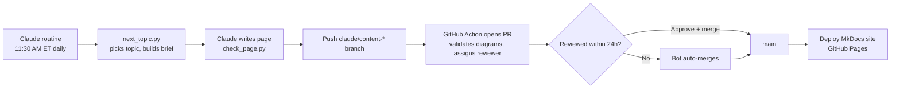

# Domain Knowledge for Full Stack Engineers

Business domains explained simply, then mapped to real system design and code.
A new topic is written by Claude every day at **11:30 AM Eastern**, reviewed through a pull request, and published to the website.

**Website:** https://dhulipalla599.github.io/domain-knowledge-engineering/

Maintainers: [@dhulipalla599](https://github.com/dhulipalla599) · [@naveenks720](https://github.com/naveenks720)

## How it works

No API key is used: the writing runs as a Claude Code routine on a Claude Pro/Max subscription, and everything else runs on free GitHub Actions.

| File / folder | Purpose |
|---|---|
| `ROUTINE_PROMPT.md` | The instructions pasted into the Claude routine |
| `config.yaml` | Tech stack, page sections, authors, reviewers, auto-merge rules |
| `domains.yaml` | Topic backlog, in order |
| `prompts/` | What each part of the page must contain |
| `scripts/next_topic.py` | Picks today's topic and writes the brief for Claude |
| `scripts/check_page.py` | Checks sections, code fences and Mermaid diagrams |
| `scripts/auto_merge.py` | Merges PRs nobody handled within 24 hours |
| `scripts/build_catalog.py` | Builds the catalog page and site navigation |
| `docs/` | Published pages, one folder per domain |
| `.github/workflows/` | Open PR on push, hourly auto-merge, website deployment |

First-time setup: [SETUP.md](SETUP.md). Review process: [docs/contributing.md](docs/contributing.md).
