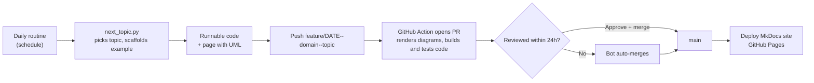

# Domain Knowledge for Full Stack Engineers

Business domains explained simply, then mapped to real system design and **runnable code**.
Every topic comes with a use case diagram, UML diagrams of the code's control flow, and a small Spring Boot project you can run with one command.
A new topic is published every day by the two maintainers: one writes it, the other reviews it through a pull request, and it goes live on the website.
Readers can add questions and answers to each domain's Q&A page, which the maintainers review and approve.

**Website:** https://dhulipalla599.github.io/domain-knowledge-engineering/

Maintainers: [@dhulipalla599](https://github.com/dhulipalla599) · [@naveenks720](https://github.com/naveenks720)

## How it works



Everything after the push (checks, merges, website) runs on free GitHub Actions.

| File / folder | Purpose |
|---|---|
| `ROUTINE.md` | The steps the daily routine follows on every run |
| `ROUTINE_PROMPT.md` | The short prompt saved in the routine (points at `ROUTINE.md`) |
| `config.yaml` | Tech stack, page sections, runnable-code settings, authors, branches, auto-merge rules |
| `domains.yaml` | Topic backlog, in order |
| `prompts/` | What each part of the page must contain |
| `templates/java-spring-boot/` | Skeleton copied for each topic's runnable example |
| `examples/<domain>/<topic>/` | Runnable Spring Boot example for each topic (`mvn spring-boot:run`) |
| `scripts/next_topic.py` | Picks today's topic, scaffolds the example, writes the writing brief |
| `scripts/check_page.py` | Checks sections, diagrams (use case, class, sequence, state, ER), and builds the example |
| `scripts/auto_merge.py` | Merges PRs nobody handled within 24 hours |
| `scripts/build_catalog.py` | Builds the catalog page, the Q&A pages and site navigation |
| `scripts/qa.py`, `qa/` | Reader Q&A: approved entries per domain (`qa/<domain>.yml`) |
| `docs/` | Published pages, one folder per domain |
| `.github/workflows/` | Open PR on push (with checks), example builds, hourly auto-merge, Q&A publishing, website deployment |
| `.github/ISSUE_TEMPLATE/qa.yml` | The form readers use to add a Q&A |

First-time setup: [SETUP.md](SETUP.md). How we work: [docs/contributing.md](docs/contributing.md).

## Add a Q&A

Open a [new Q&A issue](https://github.com/dhulipalla599/domain-knowledge-engineering/issues/new?template=qa.yml), pick the domain, and write your question and answer. A maintainer reviews it and adds the `qa-approved` label, which publishes it to that domain's Q&A page.

## Run any example

```bash
git clone https://github.com/dhulipalla599/domain-knowledge-engineering
cd domain-knowledge-engineering/examples/banking/customer-onboarding-and-kyc
mvn spring-boot:run      # needs Java 21 + Maven; no database or API keys
```
