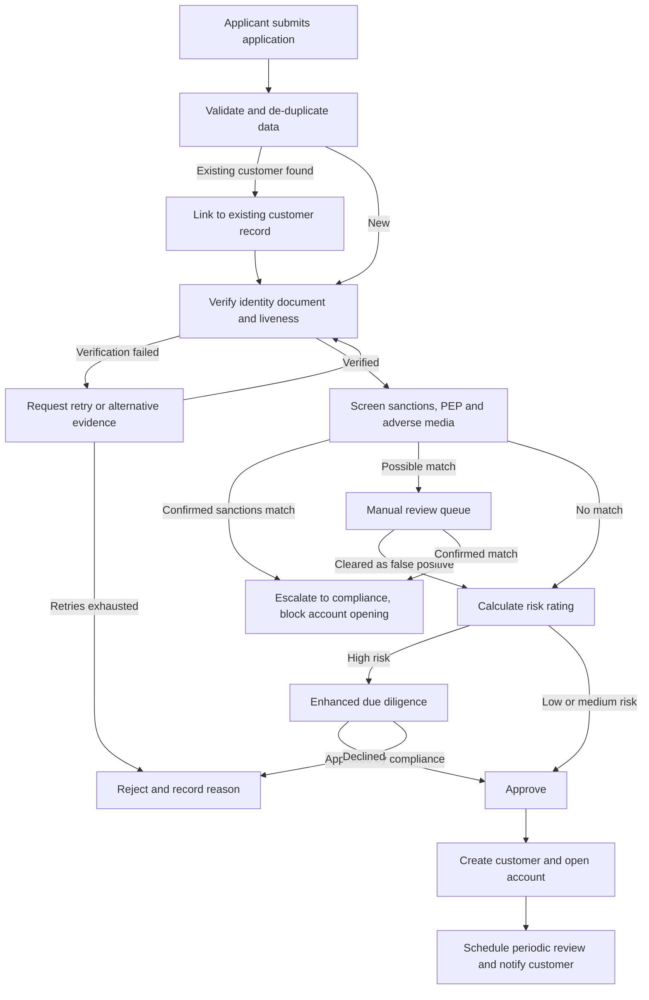
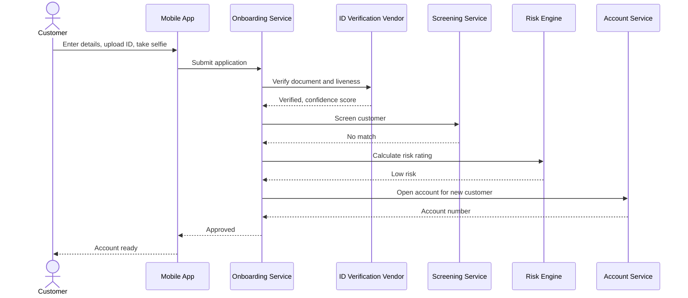
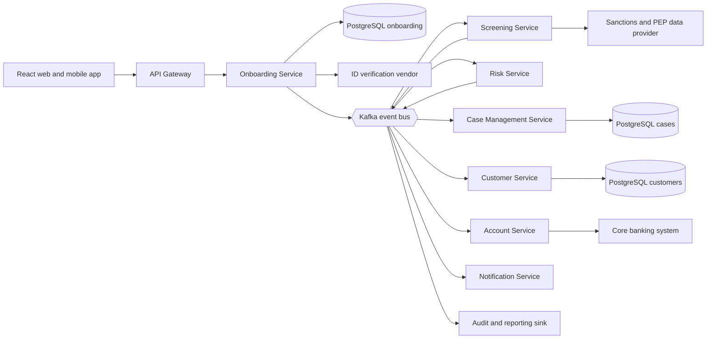
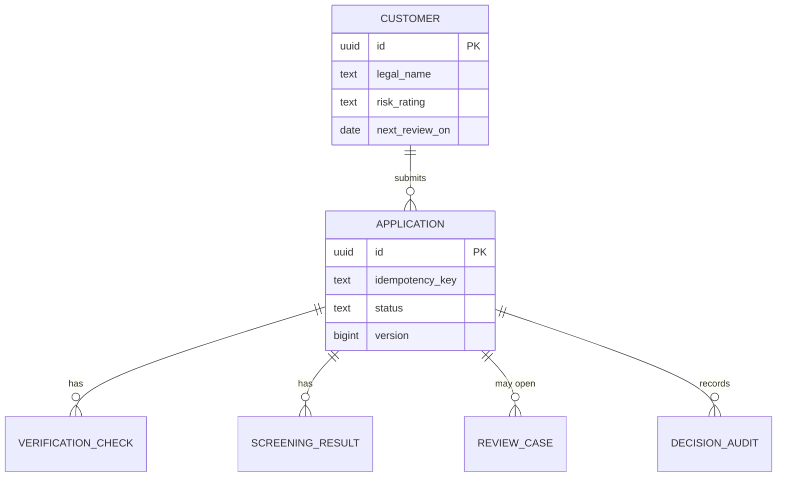

# Customer Onboarding and KYC

> **Domain:** Banking · **Generated:** October 05, 2026 with Claude.

## Explain It Like I'm Five

Imagine you want to join a big treehouse club. Before the club leader gives you a key, they ask your name, look at a card that proves who you are, and check that you are not on the list of kids who were asked never to come back. If everything looks fine, you get your key and can store your treasures in the club's safe box. If something looks odd, the leader asks a grown-up to take a closer look before letting you in. This keeps the treehouse safe for everyone, and it also means your treasures are only ever opened by you.

In a bank, customer onboarding is getting the new member signed up, and KYC ("Know Your Customer") is the checking of who they are and whether they are safe to do business with.

## Business Overview

**Customer onboarding** is the process of turning an applicant into an active customer with a usable account. **KYC** is the part of that process in which the bank identifies the person or company, verifies that identity against trustworthy evidence, screens them against sanctions and other watchlists, and assesses the risk they pose for money laundering or fraud.

Why the business cares:

- **Revenue:** every abandoned application is lost revenue. Onboarding speed and conversion are headline metrics, and the first minutes shape the relationship.
- **Risk:** accounts opened for fraudsters or money mules create direct losses and expose the bank to financial crime.
- **Regulation:** banks must run customer due diligence (CDD) and, for higher-risk customers, enhanced due diligence (EDD). The specifics differ by jurisdiction (for example the Bank Secrecy Act and CIP rule in the US, the EU Anti-Money Laundering Directives, and local regulators elsewhere), so rules must be configurable rather than hard-coded.
- **Customer experience:** customers expect to open an account on a phone in minutes, yet the bank must still gather and verify evidence.

In the Banking value chain, onboarding sits at the front: it comes after marketing and acquisition and before account servicing, payments, lending and cards. Everything downstream depends on the customer record and risk rating produced here. KYC does not end at onboarding: periodic review and event-driven review keep the information fresh.

## Real-World Example

Priya Raman applies for a current account with the fictional **Northwind Bank** using its mobile app.

1. Priya enters her name, date of birth, address, occupation and expected monthly income.
2. She photographs her passport and takes a selfie. A third-party identity verification provider (fictional "VerifyNow") checks the document and does a liveness check and face match.
3. Northwind screens her name and date of birth against sanctions lists and checks whether she is a politically exposed person (PEP). One fuzzy hit appears: a different person with a similar name.
4. The rules engine scores her as low risk, but the screening hit must be cleared. The case goes to a compliance analyst, Tomas Eriksen, who compares dates of birth and nationality and marks the hit as a false positive with a written reason.
5. The application resumes, the risk rating is recorded as Low, and the account is opened in a restricted state until the welcome steps are done.
6. Priya receives a notification, the account becomes active, and a periodic review date is scheduled according to her risk rating.

Had the screening hit been a true match, the bank would have declined or escalated under its policy, and might have been required to file a report with its financial intelligence unit, without telling the customer why (the "tipping off" rules vary by country).

## Stakeholders

| Stakeholder | What they need | What they fear |
|---|---|---|
| Applicant (retail or business customer) | A fast, simple sign-up and clear status | Repeated document requests, unexplained rejection, data misuse |
| Relationship manager / branch staff | Visibility of application status, ability to assist | Customers lost to slow processes, being blamed for onboarding errors |
| Compliance officer / MLRO | Evidence that policy was applied and decisions are explainable | Regulatory fines, missed true matches, weak audit trail |
| KYC / fraud analyst | A clear work queue with all evidence in one view | Alert overload, false positives, missing context |
| Product owner | High conversion and low time-to-open | Controls that kill conversion |
| Engineering / operations | Reliable integrations and traceable workflows | Vendor outages, stuck applications, hard-to-reproduce state |
| Regulator and auditors | Demonstrable, consistent, reviewable control | Undetected systemic gaps |
| Data protection officer | Lawful, minimal handling and retention of personal data | Over-collection, breaches, retention violations |
| External vendors (ID verification, screening) | Clean requests, reasonable load | Misuse, contract or SLA disputes |

## Key Terms

| Term | Plain-English meaning |
|---|---|
| KYC | Know Your Customer: identifying and verifying a customer and understanding their risk |
| CIP | Customer Identification Program: the minimum identity data a bank must collect and verify (US term) |
| CDD | Customer Due Diligence: the standard level of checks and risk assessment |
| EDD | Enhanced Due Diligence: deeper checks for high-risk customers, such as source-of-funds evidence |
| AML | Anti-Money Laundering: the controls used to detect and prevent laundering of illicit funds |
| Sanctions screening | Checking names against official lists of restricted people, entities and countries |
| PEP | Politically Exposed Person: someone with a prominent public role, treated as higher risk |
| UBO | Ultimate Beneficial Owner: the real person who owns or controls a company |
| Risk rating | A score or band (for example Low, Medium, High) that drives how much scrutiny a customer gets |
| Liveness check | Proving the selfie or video comes from a live person rather than a photo or deepfake |
| False positive | A screening alert on someone who is not actually the listed party |
| SAR / STR | Suspicious Activity (or Transaction) Report filed with the financial intelligence unit |
| Periodic review | Scheduled refresh of customer information, with frequency based on risk |

## Process Flow

An applicant submits personal details and identity evidence. The bank verifies the evidence electronically or manually, screens the customer against sanctions, PEP and adverse-media sources, and calculates a risk rating. Low-risk customers who pass all checks are approved automatically. Customers with unresolved screening hits, unclear documents or high-risk attributes are routed to manual review or enhanced due diligence. Rejections are recorded with a reason. Approved customers get a customer record and an account, and a review schedule is set.





## Business Rules and Edge Cases

- **Regulatory timing:** identity must generally be verified before, or in tightly limited circumstances shortly after, account opening, and before significant activity is allowed. The exact permitted window depends on the jurisdiction. Model the account as `RESTRICTED` until verification completes, not as an open account.
- **No auto-approval with unresolved hits:** a possible sanctions or PEP match must block approval until a human clears it with a recorded reason.
- **Tipping off:** never tell the applicant that a screening hit or report exists. Customer-facing messages must be generic.
- **Idempotency:** mobile networks retry. Submitting the same application twice must not create two customers or two accounts. Use a client-supplied idempotency key and natural-key checks.
- **Duplicate and existing customers:** an applicant may already be a customer through another product. Match on verified identifiers, and send ambiguous matches to review rather than merging automatically.
- **Partial failure:** the vendor may time out after verifying. Store the vendor reference before acting on results, and make every step resumable. Never leave an application in a state that cannot be reached again by a retry or a timeout job.
- **Vendor outages:** define a policy for degraded mode (queue and wait, or fall back to manual verification) rather than letting each engineer improvise.
- **Rescreening:** sanctions lists change daily. Existing customers must be re-screened when lists update, not only at onboarding.
- **Risk rating changes:** a change in occupation, country, ownership or behaviour can move a customer into EDD at any time.
- **Evidence retention:** keep documents and decisions for the period your regulator requires (commonly several years after the relationship ends, but it varies), while honouring data protection and deletion rules. Resolve the conflict through legal guidance, not code defaults.
- **Minors, joint accounts and businesses:** minors need guardian verification, joint accounts need every holder verified, and businesses require UBO identification, often through several ownership layers.
- **Data quality:** names with transliteration, multiple surnames, or no family name break naive matching and validation. Do not reject names on character rules alone.
- **Auditability:** every decision records who or what made it, the rule or model version, the inputs and the time.

## From Business to System

| Business concept / step | System component | Data entity | Event |
|---|---|---|---|
| Application submitted | Onboarding Service | `application` | `ApplicationSubmitted` |
| Identity verified | Onboarding Service + ID vendor adapter | `verification_check` | `IdentityVerified` / `IdentityVerificationFailed` |
| Sanctions and PEP screening | Screening Service | `screening_result` | `ScreeningCompleted` |
| Manual review | Case Management Service | `review_case` | `ReviewCaseOpened` / `ReviewCaseResolved` |
| Risk rating | Risk Service | `risk_assessment` | `RiskRated` |
| Approval or rejection | Onboarding Service | `application` (status) | `ApplicationApproved` / `ApplicationRejected` |
| Customer creation | Customer Service | `customer` | `CustomerCreated` |
| Account opening | Account Service | `account` | `AccountOpened` |
| Periodic review | Review Scheduler | `review_schedule` | `PeriodicReviewDue` |
| Audit trail | Audit log (in every service) | `decision_audit` | n/a (also emitted as events) |

## Architecture



**Service boundaries.** The Onboarding Service owns the application lifecycle and orchestrates the steps, because it is the only component that knows the whole state of one applicant's journey. Screening is separate because it has its own data providers, scaling needs (batch rescreening of the whole customer base) and strict change control. The Risk Service is isolated so that rules and models can be versioned, explained and audited independently. Case Management is separate because human workflows have different lifecycles from automated checks. The Customer Service owns the golden customer record, which many other products will read. Account opening goes through the Account Service, which wraps the core banking system so that the legacy platform's interfaces do not leak into onboarding. Each service owns its own database, and services collaborate through Kafka events plus a small number of synchronous calls to external vendors.

## Data Model

```sql
CREATE TABLE customer (
    id              UUID PRIMARY KEY,
    legal_name      TEXT NOT NULL,
    date_of_birth   DATE,
    nationality     CHAR(2),
    customer_type   TEXT NOT NULL CHECK (customer_type IN ('INDIVIDUAL','BUSINESS')),
    risk_rating     TEXT NOT NULL CHECK (risk_rating IN ('LOW','MEDIUM','HIGH')),
    next_review_on  DATE,
    created_at      TIMESTAMPTZ NOT NULL DEFAULT now()
);

CREATE TABLE application (
    id               UUID PRIMARY KEY,
    idempotency_key  TEXT NOT NULL UNIQUE,
    customer_id      UUID REFERENCES customer(id),
    status           TEXT NOT NULL CHECK (status IN
                     ('SUBMITTED','VERIFYING','SCREENING','IN_REVIEW','APPROVED','REJECTED')),
    rejection_reason TEXT,
    version          BIGINT NOT NULL DEFAULT 0,
    submitted_at     TIMESTAMPTZ NOT NULL DEFAULT now(),
    decided_at       TIMESTAMPTZ
);

CREATE TABLE verification_check (
    id            UUID PRIMARY KEY,
    application_id UUID NOT NULL REFERENCES application(id),
    vendor        TEXT NOT NULL,
    vendor_ref    TEXT NOT NULL,
    outcome       TEXT NOT NULL CHECK (outcome IN ('VERIFIED','FAILED','INCONCLUSIVE')),
    confidence    NUMERIC(4,3),
    checked_at    TIMESTAMPTZ NOT NULL DEFAULT now(),
    UNIQUE (vendor, vendor_ref)
);

CREATE TABLE screening_result (
    id             UUID PRIMARY KEY,
    application_id UUID NOT NULL REFERENCES application(id),
    list_version   TEXT NOT NULL,
    outcome        TEXT NOT NULL CHECK (outcome IN ('CLEAR','POSSIBLE_MATCH','CONFIRMED_MATCH')),
    screened_at    TIMESTAMPTZ NOT NULL DEFAULT now()
);

CREATE TABLE review_case (
    id             UUID PRIMARY KEY,
    application_id UUID NOT NULL REFERENCES application(id),
    assigned_to    TEXT,
    resolution     TEXT CHECK (resolution IN ('FALSE_POSITIVE','TRUE_MATCH','APPROVED_EDD','DECLINED')),
    resolution_note TEXT,
    opened_at      TIMESTAMPTZ NOT NULL DEFAULT now(),
    closed_at      TIMESTAMPTZ
);

CREATE TABLE decision_audit (
    id             BIGSERIAL PRIMARY KEY,
    application_id UUID NOT NULL REFERENCES application(id),
    actor          TEXT NOT NULL,
    action         TEXT NOT NULL,
    rule_version   TEXT,
    detail         JSONB NOT NULL,
    occurred_at    TIMESTAMPTZ NOT NULL DEFAULT now()
);
```



In production, personal data columns would be encrypted or tokenised, and the audit table would be append-only (enforced with permissions and, where needed, write-once storage exports). Tables are shown in one schema for brevity, but under the boundaries above each service would own its tables in its own database.

## APIs

| Method | Path | Purpose |
|---|---|---|
| POST | `/api/v1/applications` | Submit a new application (requires `Idempotency-Key` header) |
| GET | `/api/v1/applications/{id}` | Read application status |
| POST | `/api/v1/applications/{id}/documents` | Upload identity documents |
| POST | `/api/v1/applications/{id}/decision` | Record a manual decision (analyst role only) |
| GET | `/api/v1/review-cases?status=OPEN` | List the analyst work queue |
| POST | `/api/v1/review-cases/{id}/resolve` | Resolve a case with a reason |
| GET | `/api/v1/customers/{id}` | Read the customer record and risk rating |

Example: `POST /api/v1/applications`

```json
{
  "customerType": "INDIVIDUAL",
  "legalName": "Priya Raman",
  "dateOfBirth": "1991-04-12",
  "nationality": "IN",
  "occupation": "Software engineer",
  "expectedMonthlyIncome": { "amount": "4200.00", "currency": "EUR" },
  "consents": { "termsVersion": "2026-03", "dataProcessing": true }
}
```

Response `202 Accepted`:

```json
{
  "applicationId": "6f1c2c1e-3a58-4b0e-9a10-7a3a2f5e8d11",
  "status": "SUBMITTED",
  "nextStep": "UPLOAD_DOCUMENTS",
  "links": { "self": "/api/v1/applications/6f1c2c1e-3a58-4b0e-9a10-7a3a2f5e8d11" }
}
```

A replay with the same `Idempotency-Key` returns the original response rather than creating a second application. Status values returned to customers are deliberately generic (for example `IN_PROGRESS`) so that reviews are never disclosed.

## Events

| Event | Producer | Consumers | Key fields |
|---|---|---|---|
| `ApplicationSubmitted` | Onboarding | Screening, Audit | applicationId, customerType, submittedAt |
| `IdentityVerified` | Onboarding | Screening, Audit | applicationId, vendorRef, confidence |
| `ScreeningCompleted` | Screening | Onboarding, Risk, Case Mgmt | applicationId, outcome, listVersion |
| `RiskRated` | Risk | Onboarding, Customer | applicationId, rating, ruleVersion |
| `ReviewCaseResolved` | Case Mgmt | Onboarding, Audit | caseId, applicationId, resolution |
| `ApplicationApproved` | Onboarding | Customer, Account, Notification | applicationId, decidedAt |
| `ApplicationRejected` | Onboarding | Notification, Audit | applicationId, reasonCode (internal) |
| `CustomerCreated` | Customer | Account, Audit | customerId, riskRating |
| `AccountOpened` | Account | Notification, Audit | customerId, accountId |

**Ordering:** key every topic by `applicationId` so that all events for one application land in the same partition and are processed in order. Cross-topic ordering is not guaranteed, so consumers must tolerate a `RiskRated` arriving before a late `ScreeningCompleted` by checking the application's state rather than assuming order.

**Idempotency:** Kafka delivers at least once. Each event carries a unique `eventId`, and consumers record processed ids (or use naturally idempotent updates) so redelivery does not open two accounts. Use the transactional outbox pattern in the producer so that the database change and the event are never out of step.

## Backend Implementation

```java
@Entity
@Table(name = "application")
public class Application {
    public enum Status { SUBMITTED, VERIFYING, SCREENING, IN_REVIEW, APPROVED, REJECTED }

    @Id private UUID id;
    @Column(name = "idempotency_key", unique = true, nullable = false)
    private String idempotencyKey;
    @Enumerated(EnumType.STRING) private Status status = Status.SUBMITTED;
    private String rejectionReason;
    @Version private long version;

    protected Application() {}
    public Application(UUID id, String idempotencyKey) {
        this.id = id;
        this.idempotencyKey = idempotencyKey;
    }

    public UUID getId() { return id; }
    public Status getStatus() { return status; }

    /** Key business rule: approval is only legal once every check has cleared. */
    public void approve(boolean identityVerified, ScreeningOutcome screening, boolean reviewOpen) {
        if (status == Status.APPROVED) return; // idempotent
        if (!identityVerified) throw new IllegalStateException("Identity not verified");
        if (screening != ScreeningOutcome.CLEAR && screening != ScreeningOutcome.CLEARED_BY_REVIEW) {
            throw new IllegalStateException("Screening not cleared");
        }
        if (reviewOpen) throw new IllegalStateException("Open review case");
        status = Status.APPROVED;
    }

    public void reject(String reason) {
        if (status == Status.APPROVED) throw new IllegalStateException("Already approved");
        status = Status.REJECTED;
        rejectionReason = reason;
    }
}

public enum ScreeningOutcome { CLEAR, POSSIBLE_MATCH, CONFIRMED_MATCH, CLEARED_BY_REVIEW }

public interface ApplicationRepository extends JpaRepository<Application, UUID> {
    Optional<Application> findByIdempotencyKey(String key);
}

@Service
public class OnboardingService {
    private final ApplicationRepository applications;
    private final OutboxPublisher outbox;
    private final DecisionContext decisions; // reads verification, screening and case state

    public OnboardingService(ApplicationRepository applications, OutboxPublisher outbox,
                             DecisionContext decisions) {
        this.applications = applications;
        this.outbox = outbox;
        this.decisions = decisions;
    }

    @Transactional
    public Application submit(String idempotencyKey) {
        return applications.findByIdempotencyKey(idempotencyKey).orElseGet(() -> {
            var app = applications.save(new Application(UUID.randomUUID(), idempotencyKey));
            outbox.publish("application.submitted", app.getId().toString(),
                           Map.of("applicationId", app.getId()));
            return app;
        });
    }

    @Transactional
    public Application evaluate(UUID id) {
        var app = applications.findById(id).orElseThrow(() -> new NotFoundException(id));
        app.approve(decisions.identityVerified(id), decisions.screening(id), decisions.reviewOpen(id));
        outbox.publish("application.approved", id.toString(), Map.of("applicationId", id));
        return app;
    }
}

@RestController
@RequestMapping("/api/v1/applications")
public class ApplicationController {
    private final OnboardingService service;

    public ApplicationController(OnboardingService service) { this.service = service; }

    @PostMapping
    public ResponseEntity<Map<String, Object>> submit(
            @RequestHeader("Idempotency-Key") String key) {
        var app = service.submit(key);
        return ResponseEntity.accepted().body(Map.of(
            "applicationId", app.getId(), "status", app.getStatus()));
    }

    @GetMapping("/{id}")
    public Map<String, Object> get(@PathVariable UUID id) {
        var app = service.evaluateStatus(id);
        return Map.of("applicationId", id, "status", app);
    }
}
```

Notes: `evaluateStatus` (omitted) maps internal states such as `IN_REVIEW` to the generic customer-facing `IN_PROGRESS`. A unique constraint on `idempotency_key` protects against two concurrent submissions that both pass the lookup; handle the resulting violation by re-reading. The `@Version` field provides optimistic locking so a manual decision and an automatic one cannot silently overwrite each other. `OutboxPublisher` writes to an outbox table inside the same transaction, and a relay publishes it to Kafka.

## Frontend Screen

```tsx
import { useEffect, useState } from "react";

type Status = "SUBMITTED" | "IN_PROGRESS" | "APPROVED" | "REJECTED";

interface ApplicationView {
  applicationId: string;
  status: Status;
}

export function ApplicationStatus({ applicationId }: { applicationId: string }) {
  const [view, setView] = useState<ApplicationView | null>(null);
  const [error, setError] = useState<string | null>(null);

  useEffect(() => {
    let cancelled = false;
    const poll = async () => {
      try {
        const res = await fetch(`/api/v1/applications/${applicationId}`);
        if (!res.ok) throw new Error(`HTTP ${res.status}`);
        const data: ApplicationView = await res.json();
        if (cancelled) return;
        setView(data);
        setError(null);
        if (data.status === "SUBMITTED" || data.status === "IN_PROGRESS") {
          timer = window.setTimeout(poll, 3000);
        }
      } catch {
        if (!cancelled) setError("We could not load your application. Please try again.");
      }
    };
    let timer = 0;
    poll();
    return () => {
      cancelled = true;
      window.clearTimeout(timer);
    };
  }, [applicationId]);

  if (error) return <p role="alert">{error}</p>;
  if (!view) return <p aria-busy="true">Loading…</p>;

  const messages: Record<Status, string> = {
    SUBMITTED: "We have received your application.",
    IN_PROGRESS: "We are checking your details. This usually takes a few minutes.",
    APPROVED: "Your account is ready.",
    REJECTED: "We are unable to open an account for you. Please contact us.",
  };

  return (
    <section aria-live="polite">
      <h2>Your application</h2>
      <p>{messages[view.status]}</p>
    </section>
  );
}
```

The screen never reveals why an application is delayed or declined, to respect tipping-off rules, and it polls with a bounded pattern that stops at a final state. A production version would add a push notification and resume the flow after document-upload failures.

## Cloud Deployment

**Main services on AWS:**

- **Amazon EKS** runs the Spring Boot services in private subnets across multiple Availability Zones.
- **Amazon RDS for PostgreSQL** (Multi-AZ) per service, or Aurora PostgreSQL, encrypted with AWS KMS keys.
- **Amazon MSK** provides managed Apache Kafka, with TLS and IAM or mTLS authentication.
- **Amazon S3** (with Object Lock where policy requires) stores identity documents, encrypted, with strict bucket policies and short-lived pre-signed URLs.
- **AWS Secrets Manager** holds vendor credentials. **AWS WAF** and an Application Load Balancer front the API gateway.
- Pods reach AWS through IAM Roles for Service Accounts (IRSA), so no long-lived keys are in containers.

```hcl
resource "aws_db_instance" "onboarding" {
  identifier                   = "onboarding-db"
  engine                       = "postgres"
  engine_version               = "16"
  instance_class               = "db.m6g.large"
  allocated_storage            = 100
  multi_az                     = true
  storage_encrypted            = true
  kms_key_id                   = aws_kms_key.pii.arn
  db_subnet_group_name         = aws_db_subnet_group.private.name
  vpc_security_group_ids       = [aws_security_group.onboarding_db.id]
  backup_retention_period      = 14
  deletion_protection          = true
  performance_insights_enabled = true
  manage_master_user_password  = true
}
```

**Security:** treat all data as sensitive personal data. Encrypt in transit and at rest, restrict access with least-privilege roles and network policies, separate analyst and engineer access, log all reads of identity documents, and keep personal data out of logs and trace attributes. Data residency requirements may force region-specific deployments.

**Scaling:** scale stateless services with the Horizontal Pod Autoscaler on CPU and request rate, and Kafka consumers on lag. Run bulk rescreening as a separate scheduled workload so it cannot starve the interactive onboarding path.

**Observability:** instrument services with OpenTelemetry (traces propagated through HTTP and Kafka headers), export to CloudWatch (via the AWS Distro for OpenTelemetry collector), and track funnel metrics such as submitted-to-approved time, drop-off per step, vendor latency and error rates, manual review backlog age and consumer lag. Alarm on stuck applications (no state change within a threshold) rather than only on errors.

## Non-Functional Requirements

| Area | Expectation | How the design meets it |
|---|---|---|
| Availability | Submission path available at the level of the bank's other digital channels (often a 99.9% class target, set by the bank) | Multi-AZ EKS and RDS, stateless services, queue-based resumption when vendors are down |
| Latency | Interactive steps return quickly; automated decisions complete in seconds to minutes | Asynchronous pipeline with a polling or push status, vendor timeouts and circuit breakers |
| Consistency | An application is never approved twice or approved without cleared checks | Aggregate-level rule in the entity, optimistic locking, idempotency keys, outbox pattern |
| Audit | Every decision reproducible: who, what, which rule version, which inputs | Append-only `decision_audit`, versioned rules, events archived to the audit sink |
| Compliance | Retention, residency, access control and reporting follow local regulation | Configurable policies per jurisdiction, encryption, role separation, retention jobs reviewed by legal |
| Privacy | Collect only what is needed, delete when allowed | Data minimisation, tokenisation of identifiers, deletion workflow aligned with retention rules |
| Recoverability | Applications survive failures and restarts | Durable state in PostgreSQL, replayable Kafka topics, tested backups |
| Fairness and explainability | Decisions can be explained to regulators | Rule and model versions stored with each decision, human review for adverse outcomes |

## AI Opportunities

1. **Document fraud and liveness detection.** Computer vision models check IDs for tampering and detect presentation attacks. *Data:* document images, selfie or video, vendor signals. *Risk:* accuracy gaps across skin tones, lighting and document types can create biased rejections. Control: measure performance by segment, offer a manual fallback, and keep humans in the loop for rejections.
2. **Fuzzy name matching and alert triage.** ML ranks screening alerts so analysts see likely true matches first and false positives are auto-documented. *Data:* names, dates of birth, nationalities, historical alert outcomes. *Risk:* suppressing a true match. Control: never auto-clear above a conservative threshold without sampling, back-test against known matches, and get compliance sign-off on thresholds.
3. **Risk scoring.** Models combine customer attributes into a risk rating suggestion. *Data:* declared occupation, geography, product, channel, historical outcomes. *Risk:* proxy discrimination and opacity. Control: use interpretable models or explanation layers, document features, and monitor drift and fairness.
4. **LLM assistant for analysts.** An agent summarises evidence, drafts case notes and extracts ownership structures from corporate documents. *Data:* case records, registry extracts, adverse-media articles. *Risk:* hallucinated facts and leaking personal data. Control: ground answers in cited sources, restrict data scope, log prompts and outputs, and require an analyst to approve every decision.
5. **Adverse-media screening.** NLP finds and classifies negative news about a customer. *Data:* news and web sources, entity resolution outputs. *Risk:* mistaken identity and false allegations. Control: confidence thresholds, source citations and human confirmation before any action.

Regulators in many jurisdictions expect model risk management and, for automated decisions about individuals, may require explanations or human review (for example under data protection law). Treat AI output as decision support unless policy and law clearly allow otherwise.

## Common Pitfalls

- **Treating KYC as a one-time form.** It is a lifecycle: onboarding, rescreening, periodic and event-driven review. Design the schedule and triggers from day one.
- **Hard-coding rules.** Requirements differ by country, product and customer type and change often. Keep rules versioned and configurable.
- **Opening the account fully before checks complete.** Use a restricted state and enforce limits in downstream systems.
- **Losing the audit trail.** Overwriting status without recording who, why and under which rule version fails audits.
- **Not being idempotent.** Retries and duplicated Kafka messages create duplicate customers and accounts.
- **Leaking compliance information.** Error messages such as "you are on a sanctions list" break tipping-off rules. Use generic messages.
- **Rejecting unusual names.** Strict validation excludes real customers. Support Unicode, long names and missing parts.
- **Putting personal data in logs, traces or analytics.** Redact and tokenise by default.
- **Trusting the vendor blindly.** Keep vendor reference ids, handle timeouts and unexpected results, and avoid vendor lock-in through an adapter layer.
- **Ignoring the human queue.** Analyst tooling, SLAs and backlog monitoring are part of the system. A silent backlog is a stuck-customer problem.
- **Merging customers automatically on weak matches.** Wrong merges are a data-protection and fraud risk.

## Interview Questions

### Junior

**1. What is KYC and why do banks do it?**
KYC is identifying and verifying a customer and assessing their risk. Banks do it to comply with AML and sanctions regulation, to prevent fraud and money laundering, and to understand who they are doing business with.

**2. Why shouldn't an onboarding API create a new customer every time it receives the same request?**
Clients and networks retry. Without idempotency (an idempotency key and a unique constraint), a retry could create duplicate customers or accounts. The API should return the original result for a repeated key.

**3. What is a false positive in sanctions screening?**
It is an alert on someone who is not actually the listed party, for example a different person with a similar name. An analyst must review the alert, compare identifying details and record the reason before the application proceeds.

### Mid-Level

**1. How would you handle an ID verification vendor timing out after the vendor has actually verified the customer?**
Store the vendor reference before waiting for the result, make the call safe to retry using that reference, and add a reconciliation job that fetches the outcome for applications stuck in `VERIFYING`. Use circuit breakers and a defined fallback (queue or manual verification). Make state transitions idempotent.

**2. A screening result arrives after the risk result for the same application. How does your design cope?**
Keying events by application id keeps per-application order within a topic, but order across topics is not guaranteed. The onboarding service should evaluate the application state from persisted facts (identity, screening, risk, open cases) whenever an event arrives, rather than assuming order, and only approve when all required facts are present.

**3. How do you keep personal data safe in logs and traces?**
Never log request bodies by default, mask or tokenise identifiers, use allow-lists for trace attributes, encrypt storage, restrict access, and test with automated checks that detect personal data patterns in log output.

### Senior / Architect

**1. Design onboarding for a bank operating in several countries with different KYC rules.**
Strong answers cover: a policy and rules engine with per-jurisdiction versioned configuration; a common core workflow with country-specific steps; data residency and regional deployment options; vendor abstraction per region; shared customer identity versus regional records; audit of which policy version applied; change management with compliance; and testing by replaying historical cases against new rules.

**2. Build or buy the screening and identity verification capability?**
Key points: regulatory expectations and accountability stay with the bank even when buying; cost and accuracy trade-offs; vendor lock-in and an adapter layer; data protection and cross-border transfer issues; the ability to tune thresholds and explain results; exit strategy and multi-vendor fallback; resilience and SLAs; and the operating model of the analyst team.

**3. How do you make approvals both fast for good customers and safe for risky ones?**
Key points: risk-based tiers with straight-through processing for low-risk, clean cases; asynchronous orchestration with clear states; restricted account capabilities until checks complete; ML-assisted triage with conservative thresholds and human review of adverse outcomes; measuring funnel and false-positive rates; feedback loops from downstream fraud outcomes; and monitoring for fairness and drift.

## Further Learning

- FATF Recommendations on customer due diligence and the risk-based approach
- Basel Committee guidance on sound management of ML/TF risks
- EU Anti-Money Laundering Directives and the AML Regulation framework
- US Bank Secrecy Act, USA PATRIOT Act and the Customer Identification Program rule
- Wolfsberg Group guidance on KYC and correspondent banking
- NIST Digital Identity Guidelines (SP 800-63)
- ISO/IEC 30107 (presentation attack detection) and ISO/IEC 29115 (entity authentication assurance)
- Event-driven patterns: transactional outbox, saga orchestration and idempotent consumers

## Practitioner Notes

> _Reviewer: add real-world experience, corrections or gotchas here before approving._
