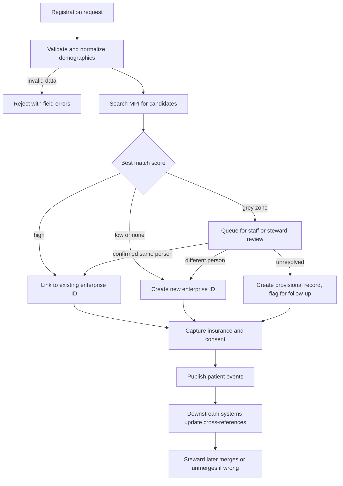
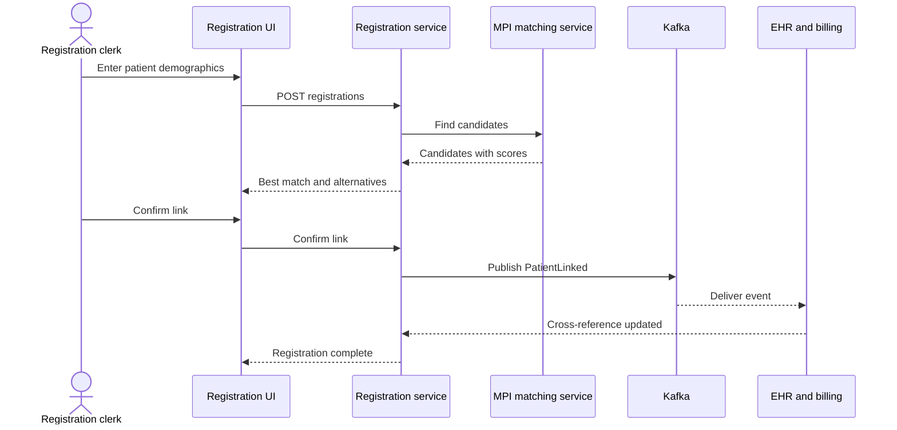
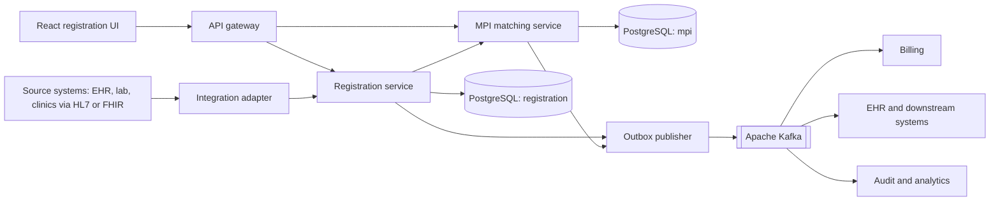
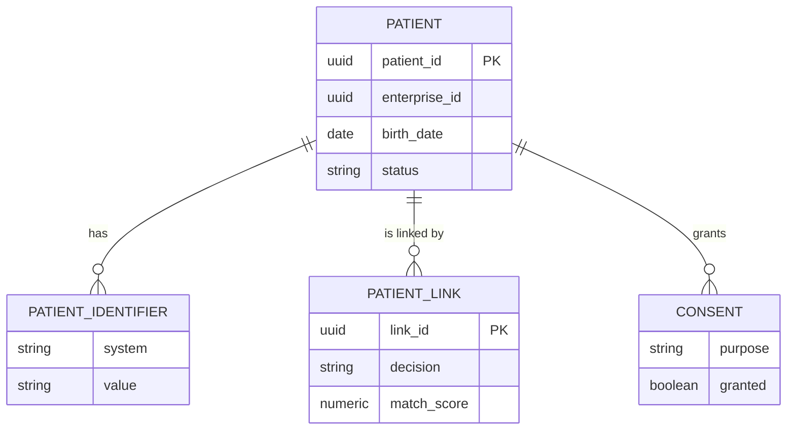

# Patient Registration and Master Patient Index

> **Domain:** Healthcare · **Generated:** October 06, 2026 with Claude.

## Explain It Like I'm Five

Imagine a huge school with several classrooms, a library and a lunchroom. Each one keeps its own list of kids, and each list spells names a little differently: "Bobby", "Robert", "Rob". One day the nurse needs to know which allergies Robert has, but the lunchroom list says "Bobby" and the library list has his old address. So the school keeps one special master notebook. Every time a kid shows up, a helper checks the notebook, works out whether this is a kid already listed, and gives each child exactly one card number that every classroom uses.

In healthcare, patient registration plus the Master Patient Index (MPI) is that notebook: it makes sure every system agrees which real person a record belongs to.

## Business Overview

**Patient registration** captures who a patient is (demographics, contact details, insurance, consent) when they first arrive or book. The **Master Patient Index** is the system that links the identifiers used by many source systems (hospital EHR, lab, radiology, billing, clinics) to one enterprise-wide person identity, often called an EMPI (Enterprise MPI).

Why the business cares:

- **Patient safety:** a duplicate record can hide allergies or past results; an overlay (two people merged into one record) can lead to wrong treatment.
- **Revenue:** wrong or duplicate demographics and insurance data cause claim denials and rework in billing.
- **Regulation and privacy:** access and disclosure rules (for example HIPAA in the US, GDPR in the EU, and national rules elsewhere) require knowing exactly whose data is being shared and with whom.
- **Experience:** patients should not be asked the same questions at every desk.
- **Interoperability:** exchanging records with other organisations (HL7 v2, FHIR, national or regional exchanges) depends on matching the right person.

It sits at the very start of the healthcare value chain (access, scheduling, registration), and feeds clinical care, billing and claims, population health and analytics. Practices differ by country: some have a national patient identifier, others (such as the US) have none, so probabilistic matching is essential.

## Real-World Example

Fictional Riverbend Health runs a hospital and three clinics. Maria Gonzales, 42, books a visit at Riverbend Eastside Clinic online.

1. Maria enters her name, date of birth, phone and address. The registration service searches the MPI.
2. The MPI finds a candidate: "Maria Gonzalez", same date of birth, same phone, an old address, created at the hospital in 2019. The match score falls in the grey zone between auto-match and no-match.
3. The system does not auto-merge. At check-in the front-desk clerk, Tom, sees both candidates side by side and confirms identity using a photo ID. He links the new registration to the existing enterprise ID.
4. Tom updates the address (the old one is kept as history) and records her insurance and consent preferences.
5. A `PatientLinked` event is published. The EHR, billing and lab systems update their cross-references so her 2019 allergy to penicillin now appears in the clinic's chart.
6. Weeks later a data steward finds that another "Maria Gonzales" with a different date of birth was wrongly linked by a different clinic. The steward unlinks them, and the change is audited and re-published so downstream systems repair their records.

## Stakeholders

| Stakeholder | What they need | What they fear |
|---|---|---|
| Patient | Fast registration, correct record, privacy | Wrong treatment, leaked data, repeating information |
| Front-desk / registration clerk | Quick search, clear match suggestions | Creating duplicates, slow screens in a queue |
| Clinician | The complete, correct chart | Missing allergies, another patient's data in the chart |
| HIM / data steward | Tools to review, merge and unmerge | Overlays, an unmanageable duplicate backlog |
| Billing / revenue cycle | Accurate demographics and insurance | Claim denials, duplicate accounts |
| Compliance / privacy officer | Audit trail, consent enforced, minimum necessary access | Breaches, unauthorised access to records |
| Integration team | Stable identifiers and events | Breaking downstream systems when identities change |
| IT / security | Resilient, observable, secure service | Outages at the front door of the hospital |

## Key Terms

| Term | Plain-English meaning |
|---|---|
| MPI / EMPI | Master Patient Index (Enterprise MPI): the registry that links a person's identifiers across systems |
| MRN | Medical Record Number: an identifier issued by one facility or system |
| Enterprise ID | The single identifier the MPI assigns to a person across the organisation |
| Duplicate | Two records for the same person |
| Overlay | One record that wrongly mixes two different people |
| Deterministic matching | Match by exact rules, for example same national ID |
| Probabilistic matching | Match by weighted score across fuzzy fields (name, date of birth, address) |
| Golden record | The best-known consolidated view of a person's demographics |
| Merge / unmerge | Combining linked records into one identity, and reversing it when wrong |
| Data steward | Person who reviews uncertain matches and fixes data quality |
| ADT | Admit, Discharge, Transfer: HL7 messages that announce patient events |
| FHIR Patient / HL7 v2 | Standard formats for exchanging patient data (FHIR `Patient` resource, v2 `ADT^A28` and `A31` messages) |
| Consent | The patient's recorded permissions about sharing and use of their data |

## Process Flow

A patient registers (online, at a desk or via an inbound ADT message). The system normalises the data (case, phone format, address), searches the MPI for candidates and scores them. A high score auto-links to an existing identity, a low score creates a new identity, and anything in between goes to a human review queue. Registration completes with insurance and consent capture, and the outcome is published as events so downstream systems stay aligned. Later, stewards fix wrong links through merge and unmerge, and every change is audited.





## Business Rules and Edge Cases

- **Never auto-merge on weak evidence.** A false merge (overlay) is far more dangerous than a duplicate. Auto-link only above a conservative threshold, and send the grey zone to humans.
- **Twins, family members and common names:** same address, phone and surname with a similar first name is a classic false match. Date of birth and given name must weigh heavily.
- **Unknown or unconscious patients:** emergency registration creates a temporary identity (for example "Trauma Alpha 1"), later reconciled with the real identity. Plan for this merge.
- **Name changes and data quality:** marriage, transliteration, nicknames, typos, swapped day and month, placeholder values such as "01/01/1900" or "UNKNOWN". Treat placeholders as missing, not as evidence.
- **Unmerge must be possible.** Keep survivorship history and the original source records so a wrong merge can be reversed without data loss.
- **Idempotency:** the same ADT message or API call may arrive twice (retries, interface engines). Use a client request key so you do not create two people.
- **Concurrency:** two clerks registering the same patient at the same moment can both find "no match". Use unique constraints on strong identifiers and re-check after commit.
- **Out-of-order events:** a merge event can arrive before the create event at a consumer. Use version numbers.
- **Privacy and consent:** search results should show only the minimum fields to confirm identity. Searching and viewing records is itself an access that must be logged. Some records (sensitive services, VIPs, minors, protected addresses) need extra protection, with rules that vary by jurisdiction.
- **Partial failure:** registration succeeds but publication fails. The record and the event must be saved atomically (see the outbox pattern below).
- **Identifier rules differ by country:** do not hard-code one national ID format; make identifier types and validation configurable.

## From Business to System

| Business concept or step | System component | Data entity | Event |
|---|---|---|---|
| Capture demographics | Registration service | `patient`, `patient_identifier` | `PatientRegistered` |
| Find existing person | MPI matching service | `match_candidate` | none (query) |
| Link to existing identity | MPI service | `patient_link` | `PatientLinked` |
| Staff review of uncertain match | Review queue (steward API and UI) | `match_review` | `MatchReviewRequested` |
| Merge or unmerge | MPI service | `patient_link` (status and history) | `PatientMerged`, `PatientUnmerged` |
| Update demographics | Registration service | `patient` (versioned) | `PatientUpdated` |
| Record consent | Consent module in registration service | `consent` | `ConsentChanged` |
| Audit who looked at what | Audit logging | `audit_log` | `PatientRecordAccessed` |
| Notify other systems | Outbox publisher | `outbox_event` | all of the above |

## Architecture



**Service boundaries.** The *Registration service* owns the person's demographic facts, insurance and consent, and the workflow a clerk goes through. The *MPI matching service* owns identity: identifiers, scoring rules, links and merge history. They are split because matching is compute-heavy, changes with tuning and data-science work, and needs its own scaling and its own strict audit, while registration is a transactional, UI-driven workflow. The *integration adapter* isolates HL7 v2 and FHIR parsing from the core model so legacy formats do not leak inward. Kafka decouples downstream consumers, which need to learn about identity changes but must not block registration.

## Data Model

```sql
CREATE TABLE patient (
    patient_id      UUID PRIMARY KEY,
    enterprise_id   UUID NOT NULL,
    family_name     TEXT NOT NULL,
    given_name      TEXT NOT NULL,
    birth_date      DATE NOT NULL,
    sex_at_birth    TEXT,
    phone           TEXT,
    address         JSONB,
    status          TEXT NOT NULL DEFAULT 'ACTIVE',  -- ACTIVE, PROVISIONAL, MERGED
    version         BIGINT NOT NULL DEFAULT 0,
    created_at      TIMESTAMPTZ NOT NULL DEFAULT now(),
    updated_at      TIMESTAMPTZ NOT NULL DEFAULT now()
);
CREATE INDEX patient_enterprise_idx ON patient (enterprise_id);
CREATE INDEX patient_dob_family_idx ON patient (birth_date, lower(family_name));

CREATE TABLE patient_identifier (
    identifier_id   UUID PRIMARY KEY,
    patient_id      UUID NOT NULL REFERENCES patient(patient_id),
    system          TEXT NOT NULL,   -- e.g. facility MRN namespace, national ID type
    value           TEXT NOT NULL,
    UNIQUE (system, value)
);

CREATE TABLE patient_link (
    link_id         UUID PRIMARY KEY,
    source_patient  UUID NOT NULL REFERENCES patient(patient_id),
    target_enterprise_id UUID NOT NULL,
    match_score     NUMERIC(5,4),
    decision        TEXT NOT NULL,   -- AUTO, MANUAL, UNLINKED
    decided_by      TEXT NOT NULL,
    decided_at      TIMESTAMPTZ NOT NULL DEFAULT now()
);

CREATE TABLE consent (
    consent_id      UUID PRIMARY KEY,
    patient_id      UUID NOT NULL REFERENCES patient(patient_id),
    purpose         TEXT NOT NULL,
    granted         BOOLEAN NOT NULL,
    effective_at    TIMESTAMPTZ NOT NULL
);

CREATE TABLE outbox_event (
    event_id        UUID PRIMARY KEY,
    aggregate_id    UUID NOT NULL,
    event_type      TEXT NOT NULL,
    payload         JSONB NOT NULL,
    created_at      TIMESTAMPTZ NOT NULL DEFAULT now(),
    published_at    TIMESTAMPTZ
);
```



Audit records of who searched or viewed a patient should go to an append-only audit store, kept separate from the operational tables.

## APIs

| Method | Path | Purpose |
|---|---|---|
| POST | `/api/v1/registrations` | Register a patient; returns match outcome |
| POST | `/api/v1/patients/search` | Search candidates (POST to keep personal data out of URLs and logs) |
| GET | `/api/v1/patients/{id}` | Fetch a patient (access is audited) |
| PUT | `/api/v1/patients/{id}` | Update demographics (optimistic locking via `If-Match`) |
| POST | `/api/v1/patients/{id}/links` | Confirm a link to an enterprise ID |
| DELETE | `/api/v1/patients/{id}/links/{linkId}` | Unlink a wrong match |
| GET | `/api/v1/match-reviews` | List the steward review queue |
| POST | `/api/v1/match-reviews/{id}/decision` | Steward decides link or not |

Example `POST /api/v1/registrations` with an `Idempotency-Key` header:

```json
{
  "givenName": "Maria",
  "familyName": "Gonzales",
  "birthDate": "1984-03-12",
  "phone": "+1-555-0142",
  "address": { "line1": "12 Elm St", "city": "Riverbend", "postalCode": "00000" },
  "identifiers": [{ "system": "riverbend-eastside-mrn", "value": "E-90311" }]
}
```

Response (`202 Accepted` because human review is needed):

```json
{
  "patientId": "6b1f2d9e-3c7a-4f0e-9a52-1d7e0c1a8a11",
  "status": "PENDING_REVIEW",
  "match": {
    "outcome": "REVIEW",
    "bestCandidate": {
      "enterpriseId": "a2c0e5d4-8c0b-4b77-9f61-5b3a2f6d4e10",
      "score": 0.87,
      "matchedOn": ["birthDate", "phone", "familyName(fuzzy)"]
    }
  }
}
```

## Events

| Event | Producer | Consumers | Key fields |
|---|---|---|---|
| `PatientRegistered` | Registration service | EHR, billing, analytics | patientId, enterpriseId, version |
| `PatientUpdated` | Registration service | EHR, billing | patientId, changedFields, version |
| `PatientLinked` | MPI service | EHR, billing, lab | enterpriseId, patientId, score, decision |
| `PatientMerged` | MPI service | All downstream systems | survivingEnterpriseId, retiredEnterpriseId, version |
| `PatientUnmerged` | MPI service | All downstream systems | restoredEnterpriseId, patientIds, version |
| `MatchReviewRequested` | MPI service | Steward worklist | reviewId, candidates |
| `ConsentChanged` | Registration service | Data-sharing and analytics | patientId, purpose, granted, effectiveAt |

**Ordering:** key messages by `enterpriseId` so all changes to one identity land in one partition in order. Merge and unmerge events are especially order-sensitive. **Idempotency:** every event carries a unique `eventId` and a monotonic `version`; consumers store the last version applied and ignore duplicates or stale events. Producers use the transactional outbox so the database change and the event cannot diverge. Keep personal data in events minimal (identifiers and changed field names rather than full demographics) where consumers can fetch details through authorised APIs.

## Backend Implementation

```java
@Entity
@Table(name = "patient")
public class Patient {
    @Id private UUID patientId;
    private UUID enterpriseId;
    private String familyName;
    private String givenName;
    private LocalDate birthDate;
    private String status;
    @Version private long version;
    // constructors, getters omitted
}

public interface PatientRepository extends JpaRepository<Patient, UUID> {
    @Query("""
        select p from Patient p
        where p.birthDate = :dob and lower(p.familyName) like lower(concat(:prefix, '%'))
        """)
    List<Patient> findCandidates(LocalDate dob, String prefix);
}

public record Candidate(UUID enterpriseId, double score) {}
public record RegistrationResult(UUID patientId, String outcome, Candidate best) {}

@Service
public class RegistrationService {
    private static final double AUTO_LINK = 0.95;
    private static final double REVIEW = 0.75;

    private final PatientRepository patients;
    private final MatchScorer scorer;          // weighted fuzzy comparison
    private final OutboxWriter outbox;
    private final IdempotencyStore idempotency;

    // constructor omitted

    @Transactional
    public RegistrationResult register(String idempotencyKey, RegistrationRequest req) {
        var prior = idempotency.find(idempotencyKey);
        if (prior.isPresent()) return prior.get();   // replay returns the same answer

        var candidates = patients.findCandidates(req.birthDate(), prefix(req.familyName()))
                .stream()
                .map(c -> new Candidate(c.getEnterpriseId(), scorer.score(req, c)))
                .sorted(Comparator.comparingDouble(Candidate::score).reversed())
                .toList();
        var best = candidates.isEmpty() ? null : candidates.get(0);

        UUID patientId = UUID.randomUUID();
        String outcome;
        UUID enterpriseId;
        if (best != null && best.score() >= AUTO_LINK && !ambiguous(candidates)) {
            outcome = "LINKED";  enterpriseId = best.enterpriseId();
        } else if (best != null && best.score() >= REVIEW) {
            outcome = "REVIEW";  enterpriseId = UUID.randomUUID();  // provisional identity until a human decides
        } else {
            outcome = "NEW";     enterpriseId = UUID.randomUUID();
        }

        patients.save(Patient.from(patientId, enterpriseId, req, "REVIEW".equals(outcome) ? "PROVISIONAL" : "ACTIVE"));
        outbox.add(enterpriseId, outcome.equals("LINKED") ? "PatientLinked" : "PatientRegistered", patientId);
        if (outcome.equals("REVIEW")) outbox.add(enterpriseId, "MatchReviewRequested", patientId);

        var result = new RegistrationResult(patientId, outcome, best);
        idempotency.save(idempotencyKey, result);
        return result;
    }

    // Two near-equal top candidates (e.g. twins) must never auto-link
    private boolean ambiguous(List<Candidate> c) {
        return c.size() > 1 && c.get(0).score() - c.get(1).score() < 0.05;
    }

    private String prefix(String s) { return s.substring(0, Math.min(3, s.length())); }
}

@RestController
@RequestMapping("/api/v1/registrations")
class RegistrationController {
    private final RegistrationService service;
    RegistrationController(RegistrationService service) { this.service = service; }

    @PostMapping
    ResponseEntity<RegistrationResult> register(@RequestHeader("Idempotency-Key") String key,
                                                @Valid @RequestBody RegistrationRequest req) {
        var result = service.register(key, req);
        return ResponseEntity.status("REVIEW".equals(result.outcome()) ? HttpStatus.ACCEPTED : HttpStatus.CREATED)
                .body(result);
    }
}
```

The interesting rules: thresholds are conservative, an ambiguous top two never auto-links, a grey-zone result creates a provisional identity rather than guessing, and the patient row, the outbox events and the idempotency record are written in one transaction. The candidate query uses a blocking key (birth date plus surname prefix) so matching does not scan the whole table; real systems use several blocking keys to catch typos in the surname.

## Frontend Screen

```tsx
import { useState } from "react";

type Candidate = { enterpriseId: string; score: number; name: string; birthDate: string };
type Result = { patientId: string; status: string; match?: { outcome: string; bestCandidate?: Candidate } };

export function RegistrationScreen() {
  const [form, setForm] = useState({ givenName: "", familyName: "", birthDate: "", phone: "" });
  const [result, setResult] = useState<Result | null>(null);
  const [error, setError] = useState<string | null>(null);
  const [busy, setBusy] = useState(false);

  const submit = async (e: React.FormEvent) => {
    e.preventDefault();
    setBusy(true); setError(null);
    try {
      const res = await fetch("/api/v1/registrations", {
        method: "POST",
        headers: { "Content-Type": "application/json", "Idempotency-Key": crypto.randomUUID() },
        body: JSON.stringify(form),
      });
      if (!res.ok) throw new Error(`Registration failed (${res.status})`);
      setResult(await res.json());
    } catch (err) {
      setError(err instanceof Error ? err.message : "Unexpected error");
    } finally {
      setBusy(false);
    }
  };

  const set = (k: keyof typeof form) => (e: React.ChangeEvent<HTMLInputElement>) =>
    setForm({ ...form, [k]: e.target.value });

  return (
    <form onSubmit={submit} aria-busy={busy}>
      <label>Given name <input value={form.givenName} onChange={set("givenName")} required /></label>
      <label>Family name <input value={form.familyName} onChange={set("familyName")} required /></label>
      <label>Date of birth <input type="date" value={form.birthDate} onChange={set("birthDate")} required /></label>
      <label>Phone <input value={form.phone} onChange={set("phone")} /></label>
      <button disabled={busy}>Register</button>
      {error && <p role="alert">{error}</p>}
      {result?.match?.outcome === "REVIEW" && result.match.bestCandidate && (
        <section aria-label="Possible match">
          <h3>Possible existing patient</h3>
          <p>
            {result.match.bestCandidate.name} (born {result.match.bestCandidate.birthDate}),
            confidence {(result.match.bestCandidate.score * 100).toFixed(0)}%.
            Verify with photo ID before linking.
          </p>
        </section>
      )}
    </form>
  );
}
```

The idempotency key is generated per form submission; a production screen would keep the same key across retries of the same attempt, and show candidates side by side with the minimum fields needed to verify identity.

## Cloud Deployment

Services run as Deployments on **Amazon EKS** behind an Application Load Balancer and API gateway. Managed services: **Amazon RDS for PostgreSQL** (Multi-AZ), **Amazon MSK** for Kafka, **AWS Secrets Manager** and **AWS KMS** for secrets and encryption keys, **Amazon ECR** for images, and **AWS WAF** at the edge. Whether a given workload may hold protected health information on AWS depends on the contractual and regional requirements that apply to your organisation (for example a HIPAA business associate agreement, or data residency rules), so confirm this with compliance before choosing regions and services.

```hcl
resource "aws_db_instance" "mpi" {
  identifier              = "mpi-postgres"
  engine                  = "postgres"
  engine_version          = "16"
  instance_class          = "db.r6g.large"
  allocated_storage       = 100
  multi_az                = true
  storage_encrypted       = true
  kms_key_id              = aws_kms_key.phi.arn
  backup_retention_period = 14
  deletion_protection     = true
  db_subnet_group_name    = aws_db_subnet_group.private.name
  vpc_security_group_ids  = [aws_security_group.db.id]
  username                = "mpi_admin"
  manage_master_user_password = true
}
```

- **Security:** private subnets only, security groups that allow the database from the service pods only, TLS everywhere, IAM roles for service accounts (IRSA), encryption at rest with KMS, least-privilege roles, and no personal data in logs or metric labels.
- **Scaling:** horizontal pod autoscaling on CPU and request latency; scale matching service separately; Kafka partitions sized for peak registration rates and consumer parallelism.
- **Observability:** OpenTelemetry SDK or collector exporting traces and metrics to CloudWatch. Track registration latency, auto-link, review and new-identity ratios, size of the review queue, duplicate-rate trend, outbox lag and consumer lag. Alert when the review backlog or outbox lag grows.

## Non-Functional Requirements

| Area | Expectation | How the design meets it |
|---|---|---|
| Availability | Registration is the front door; downtime halts care access. Targets are set per organisation (commonly very high), with a documented downtime procedure | Multi-AZ database, multiple pods across AZs, graceful degradation: allow provisional registration if matching is down, reconcile later |
| Latency | Search and match should feel instant at the desk (an interactive target such as well under a couple of seconds) | Blocking keys and indexes, caching reference data, matching scales independently |
| Consistency | Strong consistency for a single identity inside the MPI; eventual for downstream copies | Transactional outbox, versioned events, idempotent consumers |
| Audit | Every create, link, merge, unmerge and record access is traceable to a user and time | Append-only audit store, immutable link history, steward decisions recorded |
| Privacy and compliance | Minimum necessary access, consent respected, encryption, retention rules per jurisdiction | Role-based access, field-level masking in search results, KMS encryption, configurable retention |
| Data quality | Duplicate and overlay rates are tracked and driven down | Metrics, steward worklists, regular tuning of thresholds with measured false-match and missed-match rates |
| Recoverability | Wrong merges can be undone | Survivorship history and unmerge support |

## AI Opportunities

1. **Learned match scoring.** Use ML (for example a trained classifier on labelled steward decisions) alongside or instead of hand-weighted rules to improve duplicate detection. *Data:* historical pairs with steward outcomes, demographic fields. *Risk:* bias against names or populations that are under-represented in training data, and unexplained scores. Control: measure error rates by subgroup, keep humans in the grey zone, and return the fields that drove each score.
2. **Review-queue prioritisation and triage.** Rank steward work by clinical risk and likelihood of duplicate. *Data:* queue items, encounter schedule, past outcomes. *Risk:* low-ranked items starving. Control: age-based escalation and queue SLAs.
3. **Data-quality assistants for registration.** An LLM or rules-plus-NLP helper that spots likely typos, transposed dates and inconsistent addresses at entry, and suggests corrections. *Data:* the form input only, and address reference data. *Risk:* wrong auto-correction, and sending personal data to external services. Control: suggestions only, a person confirms, run models inside the approved environment under privacy agreements.
4. **Unstructured document intake.** Extract demographics from scanned IDs, referral letters and insurance cards. *Data:* images and documents. *Risk:* extraction errors and handling sensitive images. Control: confidence thresholds, human verification before saving, strict retention.
5. **Anomaly detection on access.** Flag unusual search or view patterns (for example snooping on a celebrity record). *Data:* audit logs. *Risk:* false alarms and employee privacy concerns. Control: transparent policy and compliance review of alerts.

## Common Pitfalls

- **Treating name plus date of birth as unique.** Use multiple attributes, scores and review, and expect common names and twins.
- **Auto-merging aggressively to hit a duplicate target.** Overlays harm patients; prefer false negatives over false positives, and measure both.
- **Making merge irreversible.** Always keep source records and links so unmerge is possible.
- **Ignoring downstream propagation.** A merge in the MPI means nothing until billing, lab and EHR apply it; publish ordered, versioned events.
- **Exposing personal data in URLs, logs and events.** Use POST for search, mask logs, and limit event payloads.
- **Hard-coding one country's identifier format** or assuming a national ID exists.
- **Skipping idempotency** on interface messages and APIs, creating duplicates on every retry.
- **No downtime procedure.** Registration cannot simply stop; design provisional registration and later reconciliation.
- **Forgetting access auditing.** Reading a record is also a regulated event.
- **Never tuning.** Match thresholds drift as data changes; review them against steward decisions regularly.

## Interview Questions

### Junior

1. **What is a Master Patient Index?** A registry that links the patient identifiers used across many systems to a single enterprise identity, so the same person is recognised everywhere.
2. **What is the difference between a duplicate and an overlay?** A duplicate is two records for one person; an overlay is one record that mixes two different people. Overlays are usually the more dangerous.
3. **Why use a POST for patient search?** To keep names and dates of birth out of URLs, server logs, browser history and proxies.

### Mid-Level

1. **How would you implement idempotent registration?** Require a client-supplied idempotency key, store the key with the result in the same transaction as the patient write, and return the stored result on replay. Add unique constraints on strong identifiers as a second defence.
2. **Why use blocking in matching?** Comparing every pair is quadratic. Blocking keys (such as birth date plus surname prefix, or phonetic codes) narrow candidates cheaply; use several keys so a typo in one field does not hide the true match.
3. **How do you publish events reliably after saving a patient?** The transactional outbox: write the event row in the same transaction as the data, and have a relay publish it to Kafka and mark it sent. Consumers must be idempotent because delivery is at least once.

### Senior / Architect

1. **Design an MPI for a hospital group with several legacy systems and no national ID.** A strong answer covers: source-system identifier cross-references, a canonical person model, deterministic plus probabilistic matching with blocking, thresholds and a steward review workflow, survivorship rules for the golden record, merge and unmerge with history, event-based propagation with ordering and versioning, FHIR and HL7 adapters, privacy, audit, and a migration and clean-up plan for existing duplicates.
2. **Trade-off: central MPI service versus federated or registry-style linking across organisations.** A strong answer covers: data ownership and legal limits on copying data, latency and availability, who resolves disputes, consent, trust between parties, referential-only (links) versus replicated demographics, and how a wrong link is unwound across organisations.
3. **How do you evaluate and safely roll out an ML-based matcher?** A strong answer covers: labelled ground truth from steward decisions, precision and recall by subgroup, shadow mode against the rules engine, thresholds set for a very low false-match rate, explainability, drift monitoring, rollback, and keeping humans in the uncertain band.

## Further Learning

- HL7 FHIR `Patient` resource and `Patient.$match` operation
- HL7 v2 ADT messages (A01, A28, A31, A40 merge)
- IHE profiles: PIX (Patient Identifier Cross-referencing) and PDQ (Patient Demographics Query)
- Probabilistic record linkage (Fellegi-Sunter model) and blocking techniques
- Data stewardship and survivorship rules in master data management
- HIPAA Privacy and Security Rules and GDPR health-data provisions (as applicable to your region)
- Transactional outbox and idempotent consumers in Kafka
- Fairness testing and evaluation of ML models in healthcare

## Practitioner Notes

> _Reviewer: add real-world experience, corrections or gotchas here before approving._
