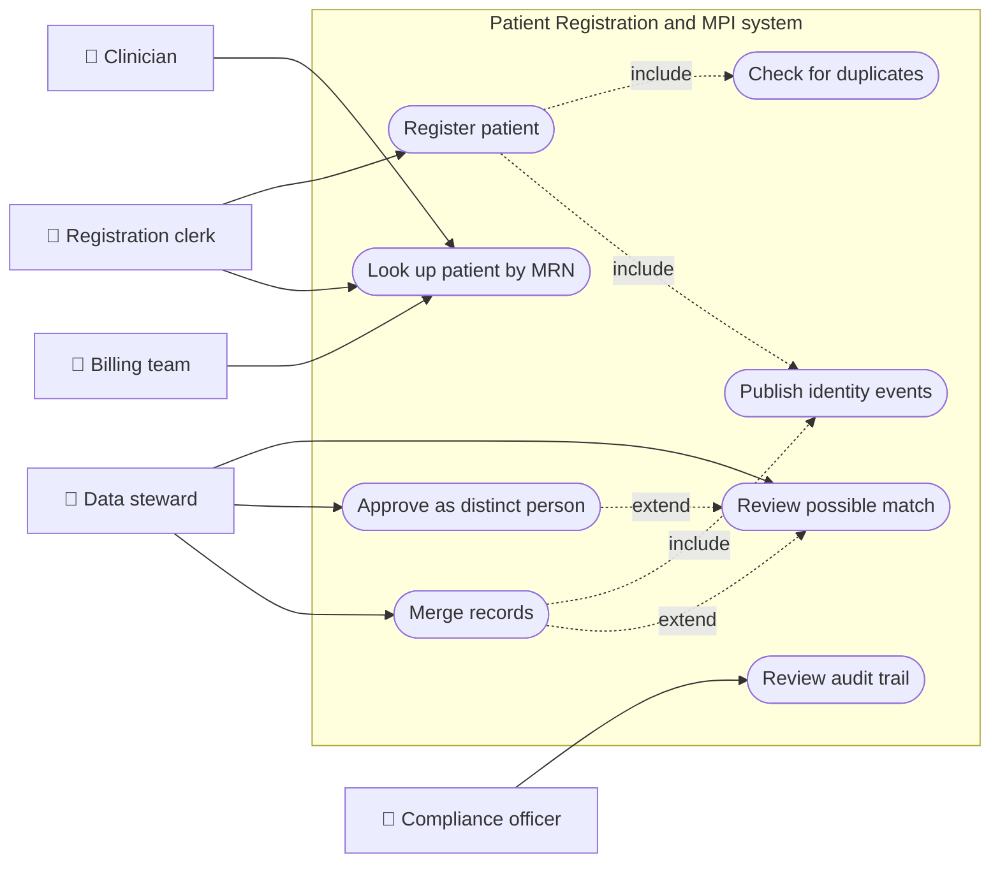
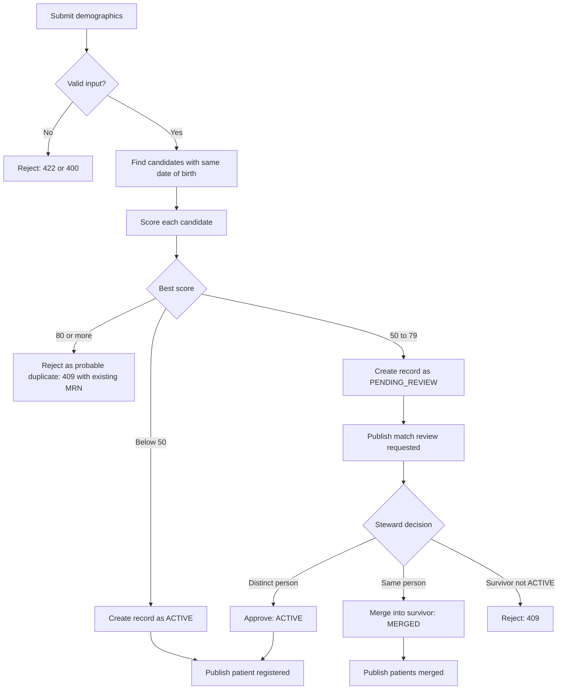
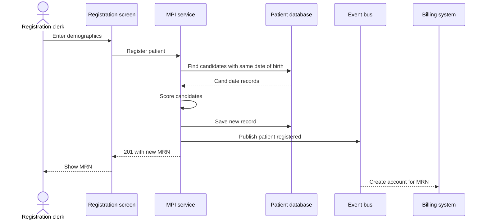
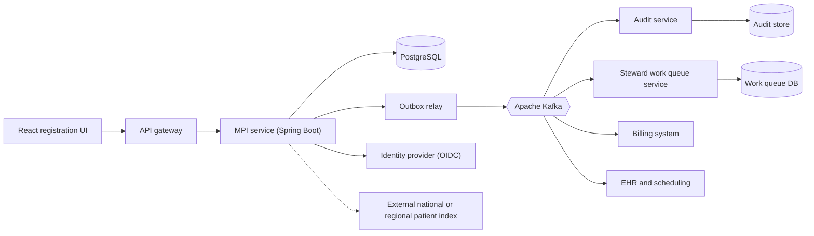
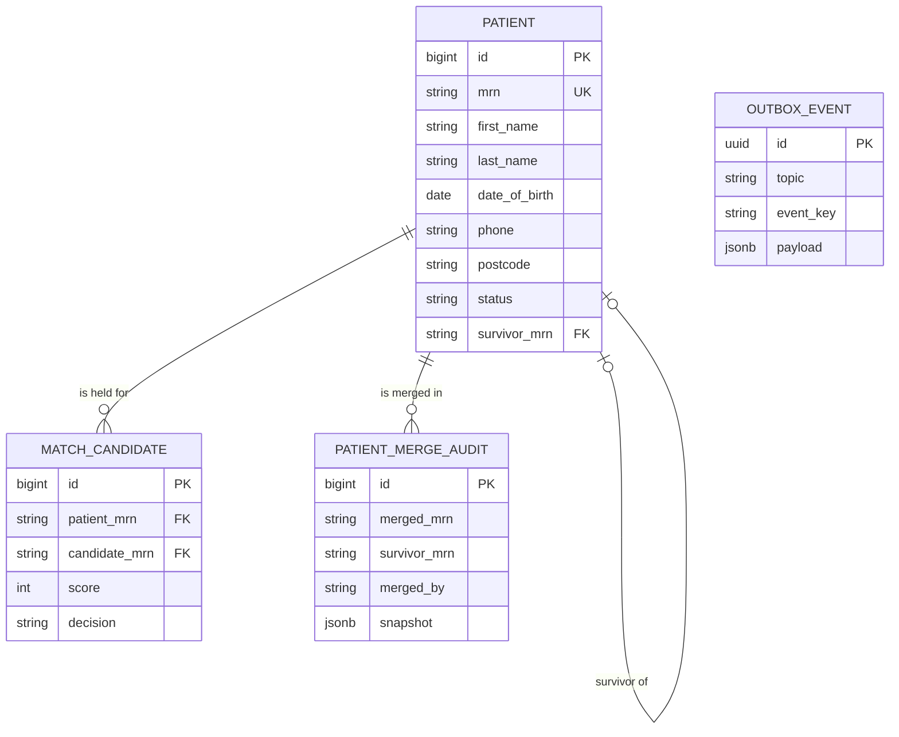
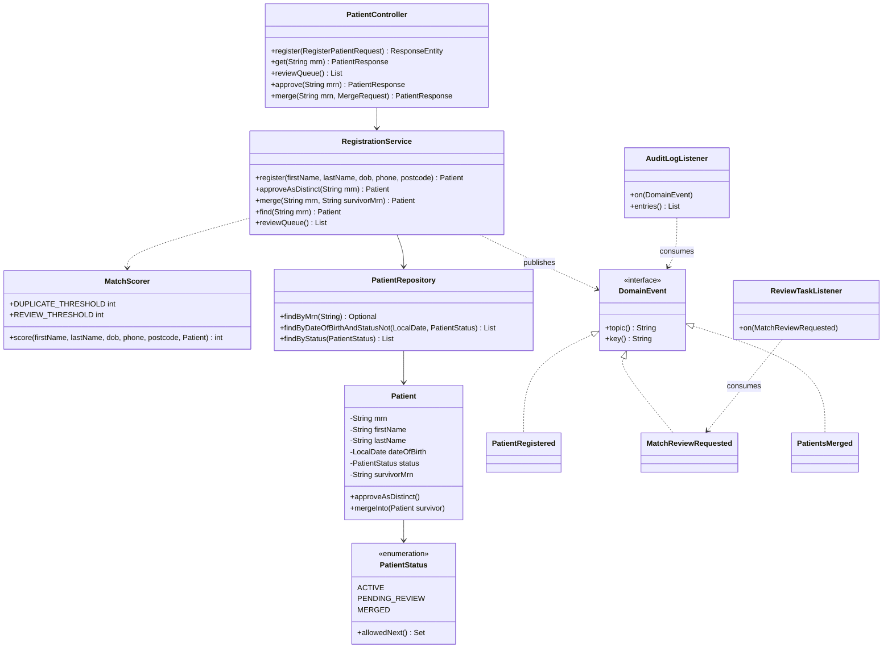
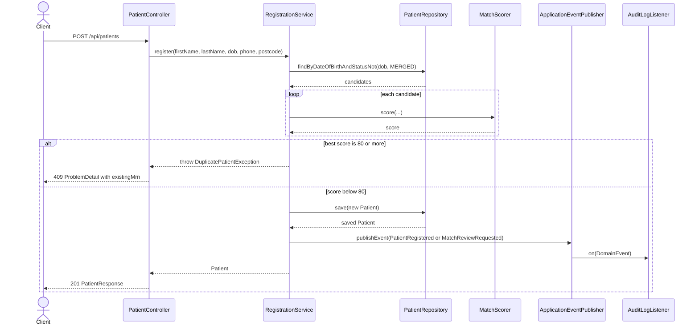
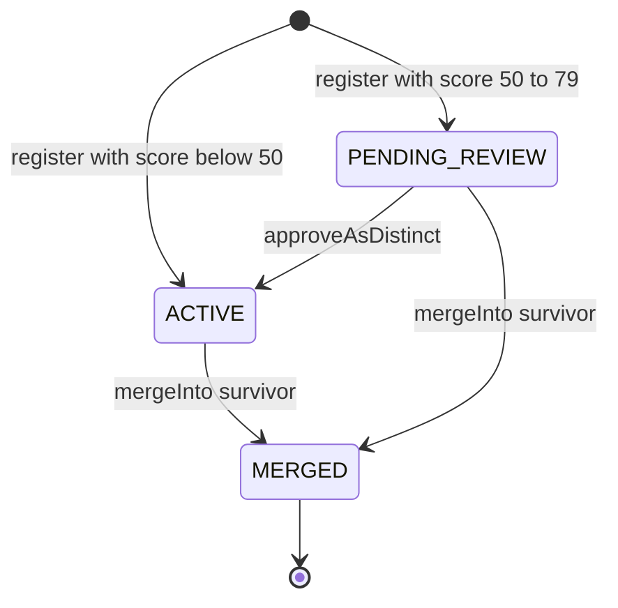
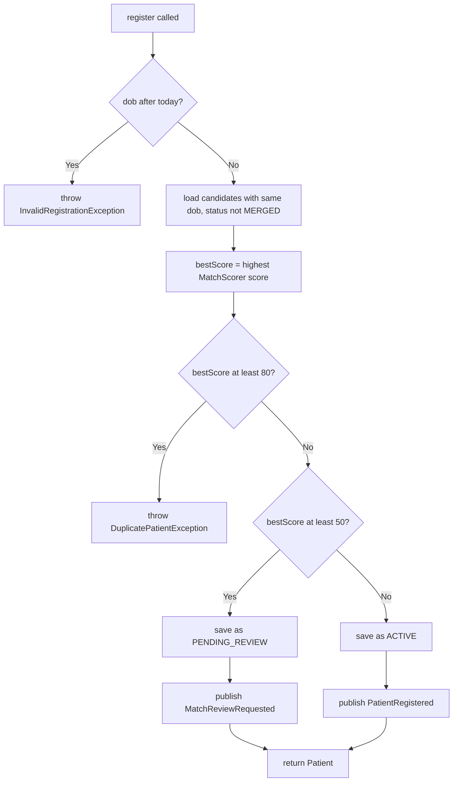

# Patient Registration and Master Patient Index

> **Domain:** Healthcare · **Generated:** October 08, 2026 with Claude.

> **Runnable code:** [`examples/healthcare/patient-registration-and-master-patient-index`](https://github.com/dhulipalla599/domain-knowledge-engineering/tree/main/examples/healthcare/patient-registration-and-master-patient-index)

## Explain It Like I'm Five

Imagine a school with a very big sticker chart. Every child gets exactly one sticker card with their name on it, and every time they do something good, the teacher adds a sticker to *that* card. Now imagine a child called "Sam" walks in and the teacher does not notice Sam already has a card, so she makes a second one. Half of Sam's stickers are on one card and half on the other, and nobody can tell how well Sam is doing. A careful teacher always asks, "Have I seen you before?" and, if two cards turn out to be the same child, tapes them together.

In a hospital, the patient card is the medical record, the "Have I seen you before?" question is patient registration, and the master patient index is the list that makes sure each person has one card, not two.

## Business Overview

**Patient registration** is the moment a person is first identified to a healthcare organisation: at a front desk, on a patient portal, through an ambulance hand-off or via a referral. The **master patient index (MPI)** is the system of record that links every record the organisation holds about a person, across clinics, labs, billing and imaging systems, to a single identifier.

Why the business cares:

- **Patient safety.** A clinician who sees only one of two records may miss an allergy or a medication. The opposite error is worse: two different people merged into one record can lead to treatment decisions being made on the wrong person's history.
- **Revenue.** Claims are rejected when demographics or insurance details do not match; duplicate records fragment charges and delay billing.
- **Regulation and privacy.** Patient identity data is regulated health information (for example under HIPAA in the United States or GDPR in the EU). Access must be limited and audited, and the rules differ by country.
- **Patient experience.** Patients dislike repeating their history at every desk.

In the value chain, registration sits at the very start of the patient journey (scheduling, registration, clinical care, coding, billing, follow-up). Almost every downstream system, from the electronic health record to the billing engine, depends on the identity it creates. Across organisations, the same problem appears as a *master patient index* inside a hospital group or an *enterprise master patient index* (EMPI) across a network; some countries instead rely on a national patient identifier, while the United States has no single national patient ID, which is why probabilistic matching is common there.

## Real-World Example

Fictional company: **Riverbend Health Network**, three clinics and one hospital sharing one MPI.

1. **Monday.** Amara Okafor (born 14 March 1988) visits the Riverside clinic for the first time. The front-desk clerk, Tomas, enters her name, date of birth, phone and postcode. The MPI finds no one with a similar profile, creates `MRN-00000001` and marks it `ACTIVE`.
2. **Three months later.** Amara comes to the hospital emergency department. A registrar types her name as "Amara Okafur" and has no phone number handy. The MPI finds her existing record with the same date of birth and a one-letter surname difference. The score is high enough to be suspicious but not enough to be sure.
3. The new record is saved as `PENDING_REVIEW` and a task appears in the data steward's queue. The registrar can still treat the patient: the hospital must never block emergency care over an identity question.
4. **Tuesday.** Data steward Priya compares the two records, confirms the same person (same phone on file at the clinic), and merges the new record into `MRN-00000001`. A `patient.merged` event tells billing and the lab system to re-point anything attached to the old number.
5. If instead the two had been different people (a parent and child with similar names and the same birthday is unusual but possible, twins are a classic case), Priya would approve the new record as distinct and it would become `ACTIVE`.

## Stakeholders

| Stakeholder | What they need | What they fear |
|---|---|---|
| Patient | One accurate record, privacy, no repeated paperwork | Wrong history used for their care; their data seen by people who should not see it |
| Registration clerk | A fast desk workflow and clear guidance when a match is found | Slowing a queue; creating a duplicate by mistake |
| Data steward (HIM staff) | A prioritised review queue with side-by-side comparison and an audit trail | Merging two different people; unreviewed backlog |
| Clinician | The complete record at the point of care | Missing allergies; acting on a merged-in wrong record |
| Billing and revenue cycle team | Clean demographics, stable identifiers | Claim rejections; charges attached to the wrong account |
| Privacy and compliance officer | Least-privilege access, full audit of who viewed or changed identity | Breach, unauthorised access, failed audit |
| Integration engineer | Stable events and APIs, safe re-processing | Downstream systems showing stale or conflicting identities |

## Use Case Diagram



| Use Case | Primary Actor | Goal | Main success outcome |
|---|---|---|---|
| Register patient | Registration clerk | Create an identity for a new patient | A new MRN is issued with status `ACTIVE`, or the clerk is pointed at the existing record |
| Check for duplicates | Registration clerk (via the system) | Avoid creating a second record for the same person | Best match score computed against candidates with the same date of birth |
| Look up patient by MRN | Clerk, clinician, billing | Retrieve the identity record | Demographics and status returned; a merged record points to its survivor |
| Review possible match | Data steward | Decide whether two records are one person | Steward sees the held record and its candidate |
| Approve as distinct person | Data steward | Release a held record | Record becomes `ACTIVE` |
| Merge records | Data steward | Collapse a duplicate into the surviving record | Record becomes `MERGED` and points to the survivor |
| Publish identity events | System | Let other systems stay in sync | Events emitted on registration, review and merge |
| Review audit trail | Compliance officer | Prove who did what | Ordered log of identity events |

## Key Terms

| Term | Plain-English meaning |
|---|---|
| MPI (master patient index) | The directory that maps every record about a person to one identity |
| EMPI | Enterprise MPI: the same idea spanning several organisations or systems |
| MRN (medical record number) | The identifier an organisation assigns to a patient; usually unique only within that organisation |
| Demographics | Name, date of birth, address, phone and similar identifying details |
| Duplicate record | Two or more records for the same person |
| Overlay | The reverse error: one record that contains data from two different people |
| Deterministic matching | Exact rules, such as "same last name and date of birth" |
| Probabilistic matching | Weighted scoring of many fields to estimate the chance two records are the same person |
| Blocking | Narrowing the candidates (for example by date of birth) before scoring, so matching scales |
| Data steward / HIM | The health information management staff who resolve uncertain matches |
| Merge (and unmerge) | Combining two records into one survivor, and the ability to reverse that if it was wrong |
| Golden record | The surviving, best-quality version of a patient's identity |
| HL7 / FHIR | Healthcare messaging and API standards; ADT messages and the FHIR `Patient` resource carry identity |

## Process Flow

A registration begins when a clerk (or the patient through a portal) submits demographics. The system validates the input, narrows candidates with the same date of birth, scores each, and takes the best score. A very high score means the person almost certainly exists already, so the clerk is shown the existing record instead of a new one. A middle score means the system cannot be sure: it creates the record on hold and queues it for a data steward, while care continues. A low score means a new patient and a new MRN. Every outcome emits an event so scheduling, billing and clinical systems can follow. A steward later approves held records as distinct or merges them into a survivor.





## Business Rules and Edge Cases

- **Never block care.** Emergency registration must work even when identity is uncertain. Real systems support temporary or "unknown patient" records and merge them later. The example holds uncertain records in review rather than refusing them.
- **False merges are worse than duplicates.** A duplicate is an inconvenience that stewards can fix; a wrong merge mixes two people's clinical histories. Thresholds should therefore favour human review over automatic merging, and every merge must be reversible (unmerge) and audited.
- **Date of birth is the most reliable blocking key, but not perfect.** Typos, unknown dates (placeholders such as 1 January), twins and family members with similar details all exist. Matching should use several fields, and the weights are an organisational decision.
- **Names are messy.** Hyphens, transliteration, nicknames, name changes after marriage, single-name cultures and inconsistent ordering vary by region. Do not assume a "first name / last name" model fits everyone; many systems store given and family names plus other fields.
- **Normalise before comparing.** Strip phone punctuation, upper-case postcodes, trim whitespace. The example does this on write and on compare.
- **Date of birth cannot be in the future.** Validate against a clock you can control in tests.
- **Merge is terminal.** A merged record only points to its survivor; the survivor must itself be active. Merging a record into itself, into another merged record, or re-merging must be rejected. Chains of merges should be flattened so lookups follow one hop.
- **Idempotency and concurrency.** Two clerks registering the same person at the same moment can both pass the duplicate check. A uniqueness constraint on the identifier, a re-check at commit, or a periodic background match job closes this gap. Retried requests (flaky network at the desk) should not create two records; use an idempotency key.
- **Partial failure.** If the record is saved but the event is not published, downstream systems never learn of the patient. Use a transactional outbox rather than publishing directly after commit.
- **Privacy.** Returning an existing record's MRN to a clerk discloses that the person is a patient. Restrict who can see match results, and log every access. Rules for what may be disclosed and to whom differ by jurisdiction.
- **Downstream identifiers.** When two records merge, labs, orders and claims referencing the old MRN must still resolve. Keep the old MRN as an alias.

## From Business to System

| Business concept or step | System component | Data entity | Event |
|---|---|---|---|
| Register a patient | `PatientController`, `RegistrationService` | `patient` | `patient.registered` |
| Check for duplicates | `MatchScorer`, `PatientRepository` | `patient` (candidates by date of birth) | none |
| Hold a possible match | `RegistrationService`, steward work queue | `patient` with status `PENDING_REVIEW` | `patient.match-review-requested` |
| Approve as distinct person | `RegistrationService.approveAsDistinct` | `patient` status to `ACTIVE` | `patient.registered` |
| Merge duplicate into survivor | `RegistrationService.merge`, `Patient.mergeInto` | `patient.survivor_mrn`, `patient_merge_audit` | `patient.merged` |
| Keep an audit trail | `AuditLogListener` (audit consumer in production) | `identity_audit` | consumes all topics |
| Keep downstream systems in sync | Billing, scheduling and EHR consumers | their own projections | consumes all topics |

## Architecture



The **MPI service** owns identity: only it creates MRNs and changes record status, so there is one place that enforces the rules. It is deliberately separate from the **EHR** (clinical data) and **billing**: they hold their own data keyed by MRN and subscribe to events, which lets each change at its own pace and keeps a clinical outage from stopping registration. The **audit service** is separate so that the audit trail is append-only and cannot be edited by the same code that changes records. The **steward work queue** is a consumer, not part of the core write path, so a slow review process never slows the front desk. An optional adapter to an external regional or national index sits behind an interface because those connections and rules differ by country.

## Data Model

```sql
CREATE TABLE patient (
    id              BIGSERIAL PRIMARY KEY,
    mrn             VARCHAR(20) NOT NULL UNIQUE,
    first_name      VARCHAR(100) NOT NULL,
    last_name       VARCHAR(100) NOT NULL,
    date_of_birth   DATE NOT NULL,
    phone           VARCHAR(20),
    postcode        VARCHAR(12),
    status          VARCHAR(20) NOT NULL CHECK (status IN ('ACTIVE','PENDING_REVIEW','MERGED')),
    survivor_mrn    VARCHAR(20) REFERENCES patient (mrn),
    created_at      TIMESTAMPTZ NOT NULL DEFAULT now()
);
CREATE INDEX idx_patient_dob ON patient (date_of_birth);

CREATE TABLE match_candidate (
    id              BIGSERIAL PRIMARY KEY,
    patient_mrn     VARCHAR(20) NOT NULL REFERENCES patient (mrn),
    candidate_mrn   VARCHAR(20) NOT NULL REFERENCES patient (mrn),
    score           INT NOT NULL,
    decision        VARCHAR(20),          -- NULL while open
    decided_by      VARCHAR(100),
    decided_at      TIMESTAMPTZ
);

CREATE TABLE patient_merge_audit (
    id              BIGSERIAL PRIMARY KEY,
    merged_mrn      VARCHAR(20) NOT NULL,
    survivor_mrn    VARCHAR(20) NOT NULL,
    merged_by       VARCHAR(100) NOT NULL,
    merged_at       TIMESTAMPTZ NOT NULL DEFAULT now(),
    snapshot        JSONB NOT NULL        -- enough to support unmerge
);

CREATE TABLE outbox_event (
    id              UUID PRIMARY KEY,
    topic           VARCHAR(100) NOT NULL,
    event_key       VARCHAR(50) NOT NULL,
    payload         JSONB NOT NULL,
    created_at      TIMESTAMPTZ NOT NULL DEFAULT now(),
    published_at    TIMESTAMPTZ
);
```



The runnable example implements only the `patient` table (through JPA on H2); the other tables show where a production design would go.

## APIs

| Method | Path | Purpose |
|---|---|---|
| POST | `/api/patients` | Register a patient (runs duplicate check) |
| GET | `/api/patients/{mrn}` | Look up a record; merged records show `survivorMrn` |
| GET | `/api/review-queue` | List records waiting for steward review |
| POST | `/api/patients/{mrn}/approve` | Steward: release a held record as a distinct person |
| POST | `/api/patients/{mrn}/merge` | Steward: merge a record into a survivor |

Example: registering a patient that is a probable duplicate.

```json
POST /api/patients
{
  "firstName": "Amara",
  "lastName": "Okafor",
  "dateOfBirth": "1988-03-14",
  "phone": "(555) 010-1234"
}
```

```json
HTTP/1.1 409 Conflict
Content-Type: application/problem+json

{
  "type": "about:blank",
  "title": "Probable duplicate patient",
  "status": 409,
  "detail": "Registration matches existing record MRN-00000001 (score 90)",
  "instance": "/api/patients",
  "existingMrn": "MRN-00000001",
  "score": 90
}
```

## Events

| Event (Kafka topic) | Producer | Consumers | Key fields |
|---|---|---|---|
| `patient.registered` | MPI service | Audit, billing, EHR and scheduling | `mrn` |
| `patient.match-review-requested` | MPI service | Steward work queue, audit | `mrn`, `candidateMrn`, `score` |
| `patient.merged` | MPI service | Billing, EHR, scheduling, audit | `mrn`, `survivorMrn` |

- **Ordering.** Key messages by MRN (merge events are keyed by the survivor) so all events for one patient land in one partition and are processed in order.
- **Idempotency.** Delivery is at least once. Give each event a unique id and have consumers store processed ids, or make handlers naturally idempotent (for example "re-point account from A to B" can be applied twice safely).
- **Reliability.** Write events to an outbox table in the same transaction as the record change, then relay them to Kafka, so a crash cannot lose or invent an event.
- **Payloads.** Keep personal data out of events where possible; send the MRN and let authorised consumers fetch details.

## Backend Implementation

The key rule lives in [`RegistrationService`](https://github.com/dhulipalla599/domain-knowledge-engineering/blob/main/examples/healthcare/patient-registration-and-master-patient-index/src/main/java/com/dke/healthcare/patient_registration_and_master_patient_index/service/RegistrationService.java): score the registration against everyone with the same date of birth, then reject, hold or accept.

```java
@Transactional
public Patient register(String firstName, String lastName, LocalDate dob, String phone, String postcode) {
    if (dob.isAfter(LocalDate.now(clock))) {
        throw new InvalidRegistrationException("Date of birth cannot be in the future");
    }
    Patient best = null;
    int bestScore = 0;
    for (Patient existing : patients.findByDateOfBirthAndStatusNot(dob, PatientStatus.MERGED)) {
        int score = MatchScorer.score(firstName, lastName, dob, phone, postcode, existing);
        if (score > bestScore) {
            best = existing;
            bestScore = score;
        }
    }
    if (bestScore >= MatchScorer.DUPLICATE_THRESHOLD) {
        throw new DuplicatePatientException(best.getMrn(), bestScore);
    }
    boolean needsReview = bestScore >= MatchScorer.REVIEW_THRESHOLD;
    Patient saved = patients.save(new Patient(firstName, lastName, dob, phone, postcode,
            needsReview ? PatientStatus.PENDING_REVIEW : PatientStatus.ACTIVE));
    events.publishEvent(needsReview
            ? new MatchReviewRequested(saved.getMrn(), best.getMrn(), bestScore)
            : new PatientRegistered(saved.getMrn()));
    return saved;
}
```

The controller endpoint that calls it:

```java
@PostMapping("/patients")
public ResponseEntity<PatientResponse> register(@Valid @RequestBody RegisterPatientRequest req) {
    var patient = service.register(req.firstName(), req.lastName(), req.dateOfBirth(), req.phone(), req.postcode());
    return ResponseEntity.created(URI.create("/api/patients/" + patient.getMrn()))
            .body(PatientResponse.from(patient));
}
```

Legal state changes are enforced inside the entity, so no caller can bypass them:

```java
private void moveTo(PatientStatus next) {
    if (!status.allowedNext().contains(next)) {
        throw new IllegalStateTransitionException(mrn, status, next);
    }
    status = next;
}

public void mergeInto(Patient survivor) {
    if (survivor == this || survivor.mrn.equals(mrn)) {
        throw new IllegalStateTransitionException(mrn, status, PatientStatus.MERGED);
    }
    if (survivor.status != PatientStatus.ACTIVE) {
        throw new IllegalStateTransitionException(survivor.mrn, survivor.status, PatientStatus.ACTIVE);
    }
    moveTo(PatientStatus.MERGED);
    this.survivorMrn = survivor.mrn;
}
```

Full source: [`examples/healthcare/patient-registration-and-master-patient-index`](https://github.com/dhulipalla599/domain-knowledge-engineering/tree/main/examples/healthcare/patient-registration-and-master-patient-index).

## Frontend Screen

The registration screen shows the result of the duplicate check inline, so the clerk sees the existing MRN when the server answers `409`.

```tsx
import { useState, FormEvent } from "react";

type Result =
  | { kind: "created"; mrn: string; status: string }
  | { kind: "duplicate"; existingMrn: string }
  | { kind: "error"; message: string };

export function RegisterPatient() {
  const [form, setForm] = useState({ firstName: "", lastName: "", dateOfBirth: "", phone: "", postcode: "" });
  const [result, setResult] = useState<Result | null>(null);
  const set = (k: keyof typeof form) => (e: { target: { value: string } }) =>
    setForm({ ...form, [k]: e.target.value });

  async function submit(e: FormEvent) {
    e.preventDefault();
    const res = await fetch("/api/patients", {
      method: "POST",
      headers: { "Content-Type": "application/json" },
      body: JSON.stringify(form),
    });
    const body = await res.json();
    if (res.status === 201) setResult({ kind: "created", mrn: body.mrn, status: body.status });
    else if (res.status === 409 && body.existingMrn) setResult({ kind: "duplicate", existingMrn: body.existingMrn });
    else setResult({ kind: "error", message: body.detail ?? "Registration failed" });
  }

  return (
    <form onSubmit={submit}>
      <input aria-label="First name" required value={form.firstName} onChange={set("firstName")} />
      <input aria-label="Last name" required value={form.lastName} onChange={set("lastName")} />
      <input aria-label="Date of birth" type="date" required value={form.dateOfBirth} onChange={set("dateOfBirth")} />
      <input aria-label="Phone" value={form.phone} onChange={set("phone")} />
      <input aria-label="Postcode" value={form.postcode} onChange={set("postcode")} />
      <button type="submit">Register</button>

      {result?.kind === "created" && (
        <p role="status">
          Registered as {result.mrn}
          {result.status === "PENDING_REVIEW" && " - held for steward review; continue with care as normal."}
        </p>
      )}
      {result?.kind === "duplicate" && (
        <p role="alert">This patient may already exist: open record {result.existingMrn}.</p>
      )}
      {result?.kind === "error" && <p role="alert">{result.message}</p>}
    </form>
  );
}
```

## Cloud Deployment

On AWS, the MPI service runs as a Kubernetes Deployment on **Amazon EKS** across three Availability Zones, behind an Application Load Balancer and **Amazon API Gateway** or an ingress controller. Typical managed services:

- **Amazon RDS for PostgreSQL** (Multi-AZ) or Aurora PostgreSQL for the patient tables.
- **Amazon MSK** for Apache Kafka.
- **Amazon Cognito** or a corporate OIDC provider for sign-in, with **AWS KMS** keys for encryption at rest.
- **AWS Secrets Manager** for database credentials, injected into pods.
- **Amazon S3** (with Object Lock) for long-term audit archives.

```hcl
resource "aws_db_instance" "mpi" {
  identifier                   = "mpi-postgres"
  engine                       = "postgres"
  engine_version               = "16"
  instance_class               = "db.r6g.large"
  allocated_storage            = 100
  multi_az                     = true
  storage_encrypted            = true
  kms_key_id                   = aws_kms_key.mpi.arn
  backup_retention_period      = 14
  deletion_protection          = true
  db_subnet_group_name         = aws_db_subnet_group.private.name
  vpc_security_group_ids       = [aws_security_group.mpi_db.id]
  performance_insights_enabled = true
  manage_master_user_password  = true
}
```

- **Security.** Private subnets for pods and databases, security groups that allow only the MPI service to reach PostgreSQL, TLS everywhere, IAM roles for service accounts, and a signed business associate or equivalent agreement with AWS where regulation requires it (for example HIPAA in the United States; requirements vary by country).
- **Scaling.** The service is stateless, so a Horizontal Pod Autoscaler scales on CPU or request rate. The index on date of birth keeps candidate lookups cheap; very large indexes move matching to a dedicated engine.
- **Observability.** Use the OpenTelemetry Java agent to export traces and metrics through the AWS Distro for OpenTelemetry collector to **CloudWatch**. Alert on 5xx rates, registration latency, review-queue depth and outbox lag. Never put patient names or dates of birth in log lines or span attributes.

## Non-Functional Requirements

| Concern | Expectation | How the design meets it |
|---|---|---|
| Availability | Registration is on the critical path of care; typical targets are high (for example 99.9% or better, set by the organisation) | Multi-AZ database and pods, stateless service, downtime procedures for paper registration |
| Latency | Duplicate check must feel instant at the desk (an organisational target, often a few hundred milliseconds) | Blocking on an indexed date of birth; scoring in memory |
| Consistency | Strong consistency for identity writes; eventual for downstream | Single writer to PostgreSQL; outbox plus Kafka for consumers |
| Accuracy | Few false merges, bounded duplicate rate | Conservative thresholds, human review of uncertain matches, reversible merges |
| Audit | Every create, view of match results, approve and merge is attributable | Audit consumer, merge snapshots, immutable archive |
| Privacy and compliance | Least privilege, encryption, retention rules; details vary by country (HIPAA, GDPR and others) | Role-based access, break-glass logging, KMS encryption, no personal data in logs |
| Recoverability | No lost identity changes | Multi-AZ, point-in-time recovery, backups tested regularly |

## Runnable Example

The example is a small master patient index that runs entirely in memory with H2. It scores a registration against existing patients that share a date of birth and rejects probable duplicates (`409`), holds possible matches for review (`PENDING_REVIEW`), or creates an `ACTIVE` record. Stewards can approve or merge held records. It also rejects a future date of birth (`422`) and illegal state changes (`409`), and publishes events named after the Kafka topics using Spring's `ApplicationEventPublisher`.

Source: [`examples/healthcare/patient-registration-and-master-patient-index`](https://github.com/dhulipalla599/domain-knowledge-engineering/tree/main/examples/healthcare/patient-registration-and-master-patient-index)

```bash
cd examples/healthcare/patient-registration-and-master-patient-index
mvn spring-boot:run     # http://localhost:8080
mvn -B -ntp verify      # build and run the tests
```

Happy path:

```bash
curl -s -X POST localhost:8080/api/patients -H 'Content-Type: application/json' \
  -d '{"firstName":"Noor","lastName":"Haddad","dateOfBirth":"1990-01-05","phone":"555-019-9000","postcode":"CF10 1AA"}'
# {"mrn":"MRN-AFCC267B","status":"ACTIVE","firstName":"Noor","lastName":"Haddad","dateOfBirth":"1990-01-05","survivorMrn":null}
```

Rule violation (probable duplicate of a seeded patient):

```bash
curl -s -X POST localhost:8080/api/patients -H 'Content-Type: application/json' \
  -d '{"firstName":"Amara","lastName":"Okafor","dateOfBirth":"1988-03-14","phone":"(555) 010-1234"}'
# {"type":"about:blank","title":"Probable duplicate patient","status":409,"detail":"Registration matches existing record MRN-00000001 (score 90)","instance":"/api/patients","existingMrn":"MRN-00000001","score":90}
```

MRNs for new patients are random, so yours will differ.

| Class | Package | Responsibility |
|---|---|---|
| `Patient` | `domain` | JPA entity; normalises input and enforces state transitions |
| `PatientStatus` | `domain` | Lifecycle enum with allowed next states |
| `DomainEvent` | `domain` | Sealed interface: topic name and partition key |
| `PatientRegistered`, `MatchReviewRequested`, `PatientsMerged` | `domain` | Event records for the three topics |
| `DuplicatePatientException`, `InvalidRegistrationException`, `IllegalStateTransitionException`, `PatientNotFoundException` | `domain` | Business errors |
| `PatientRepository` | `repository` | Spring Data repository with the date-of-birth query |
| `MatchScorer` | `service` | Deterministic 0-100 scoring and thresholds |
| `RegistrationService` | `service` | Register, approve and merge; publishes events |
| `ClockConfig` | `service` | Provides a `Clock` so dates are testable |
| `PatientController` | `api` | REST endpoints |
| `RegisterPatientRequest`, `MergeRequest`, `PatientResponse` | `api` | Request and response records |
| `ApiExceptionHandler` | `api` | Maps exceptions to `ProblemDetail` |
| `AuditLogListener`, `ReviewTaskListener` | `integration` | Event listeners standing in for Kafka consumers |

## UML Diagrams

### Class Diagram

The controller delegates to the service, which uses the repository and `MatchScorer`, mutates the `Patient` entity and publishes sealed `DomainEvent` records that the listeners consume.



### Sequence Diagram (control flow)

One registration request, including the branch where `MatchScorer` finds a probable duplicate and the service throws `DuplicatePatientException`, which the exception handler turns into a `409`.



### State Diagram

`PatientStatus.allowedNext()` allows exactly these transitions; `MERGED` has none.



### Activity Diagram

The decision logic inside `RegistrationService.register`.



## AI Opportunities

1. **Probabilistic and ML record matching.** Use: score candidate pairs from many fields (names, nicknames, addresses, phone, history) instead of fixed weights. Data: labelled steward decisions (match, no match) and demographics. Risk: bias across names and cultures leading to unequal error rates; measure precision and recall per group, keep humans in the loop for uncertain pairs, and keep the score explainable (which fields contributed).
2. **Steward work-queue prioritisation.** Use: rank review tasks by clinical urgency, upcoming appointments and model confidence so risky cases are reviewed first. Data: queue history, appointment schedule, match scores. Risk: starving low-ranked tasks; set service-level limits and audit the ranking.
3. **Data entry assistance and address or name normalisation.** Use: suggest corrections for typos and standard address formats at the desk, or extract demographics from scanned identity documents. Data: reference address data, scanned documents. Risk: wrong "corrections" silently written into legal identity data; always show the suggestion for the clerk to confirm and handle document images as sensitive data.
4. **Merge anomaly detection.** Use: flag merges that later look wrong (conflicting sex, impossible age gaps, divergent clinical histories) so stewards can unmerge. Data: merge snapshots and clinical record signals. Risk: false alarms causing alert fatigue; combine with rules and review outcomes.
5. **LLM assistant for stewards.** Use: summarise why two records may match and draft the justification note. Data: the two records, field-level differences. Risk: hallucinated reasons and exposure of patient data to external services; run only on approved, privacy-reviewed models, give the model no authority to merge, and keep the final decision human.

## Common Pitfalls

- **Treating name plus date of birth as a unique key.** Many people share both. Use scoring with several fields and human review.
- **Auto-merging aggressively.** A wrong merge is a patient-safety event. Prefer review for anything uncertain and build unmerge from day one.
- **Scoring against the whole table.** Matching every registration against every patient does not scale; use blocking keys such as date of birth, and index them.
- **Blocking care while identity is resolved.** Support temporary records and reconcile later.
- **Forgetting normalisation.** Compare normalised phone numbers, postcodes, case and whitespace, not raw strings.
- **Assuming western naming.** Check how your population records names, and avoid hard rules about first and last names.
- **Publishing events outside the transaction.** A crash between commit and publish loses events. Use an outbox.
- **Ignoring merged identifiers.** Keep old MRNs resolvable so old orders and claims still find the patient.
- **Leaking personal data.** Names and birth dates in logs, events and error messages are a compliance problem. Return identifiers, log access, and restrict who can see match results.
- **Hard-coding thresholds.** The 50 and 80 cut-offs in the example are teaching values. Tune them from your own data and review outcomes.

## Interview Questions

### Junior

1. **What is a master patient index and why does a hospital need one?**
   It is the directory that gives each person one identity across all systems and links every record about them. Without it the same person has multiple records, so clinicians see partial history and billing is fragmented.
2. **Why is a duplicate record a problem?**
   Clinical information is split across records, so allergies or medications may be missed, and charges or claims may attach to the wrong account. It also wastes steward time to fix later.
3. **In the example, what happens if the date of birth is in the future?**
   `RegistrationService.register` throws `InvalidRegistrationException`, which `ApiExceptionHandler` maps to a `422` `ProblemDetail`. Nothing is saved and no event is published.

### Mid-Level

1. **How does the example decide between rejecting, holding and accepting a registration?**
   It loads candidates with the same date of birth (blocking), scores each with `MatchScorer`, and takes the best score. 80 or more is a probable duplicate (`409`), 50 to 79 is saved as `PENDING_REVIEW` with a `MatchReviewRequested` event, and anything lower is saved as `ACTIVE`.
2. **Why do you enforce state transitions inside the entity rather than the controller?**
   Every caller goes through the same rule, so illegal changes (re-merging a merged record, merging into itself) cannot be introduced by a new endpoint or a batch job. It is easy to unit test, and the transition table lives in one place.
3. **How would you stop two clerks registering the same person at the same moment?**
   A pre-check alone is racy. Add a uniqueness or advisory-lock strategy where possible, accept that near-matches cannot be enforced by a constraint, and run a background matching job that finds duplicates created concurrently. Use idempotency keys for retried requests.

### Senior / Architect

1. **Design an enterprise MPI across several hospitals with different systems.** A strong answer covers: a central index of identities with cross-reference IDs to each source system; blocking plus probabilistic matching with tunable thresholds; steward tooling; standard interfaces (HL7 v2 ADT feeds, FHIR `Patient`, IHE profiles such as PIX and PDQ); event-driven synchronisation; reversible merges; consent and access control per organisation; and a plan for national or regional identifiers where they exist.
2. **How do you balance false merges against duplicates?** Key points: false merges are higher risk, so favour review; measure precision and recall on steward-labelled data; use different thresholds for auto-link, review and reject; track unmerge rate as a quality signal; audit changes to thresholds; and consider the clinical context (emergency versus scheduled care).
3. **How would you make merges safe and reversible at scale?** Key points: never delete the merged record, keep a snapshot and alias table; propagate `patient.merged` with ordering by survivor key; make downstream handlers idempotent; define unmerge as its own event that restores snapshots and re-splits dependent data; handle in-flight orders; test with replay in a staging copy; and audit who merged what and when.

## Further Learning

- HL7 v2 ADT messages (patient administration)
- HL7 FHIR `Patient` resource and `$match` operation
- IHE integration profiles PIX and PDQ for patient identifier cross-referencing
- Fellegi-Sunter probabilistic record linkage
- Blocking and entity resolution techniques
- HIPAA Privacy and Security Rules, and GDPR for health data
- Transactional outbox and idempotent consumers
- Master data management (MDM) concepts and data stewardship

## Practitioner Notes

> _Reviewer: add real-world experience, corrections or gotchas here before approving._
